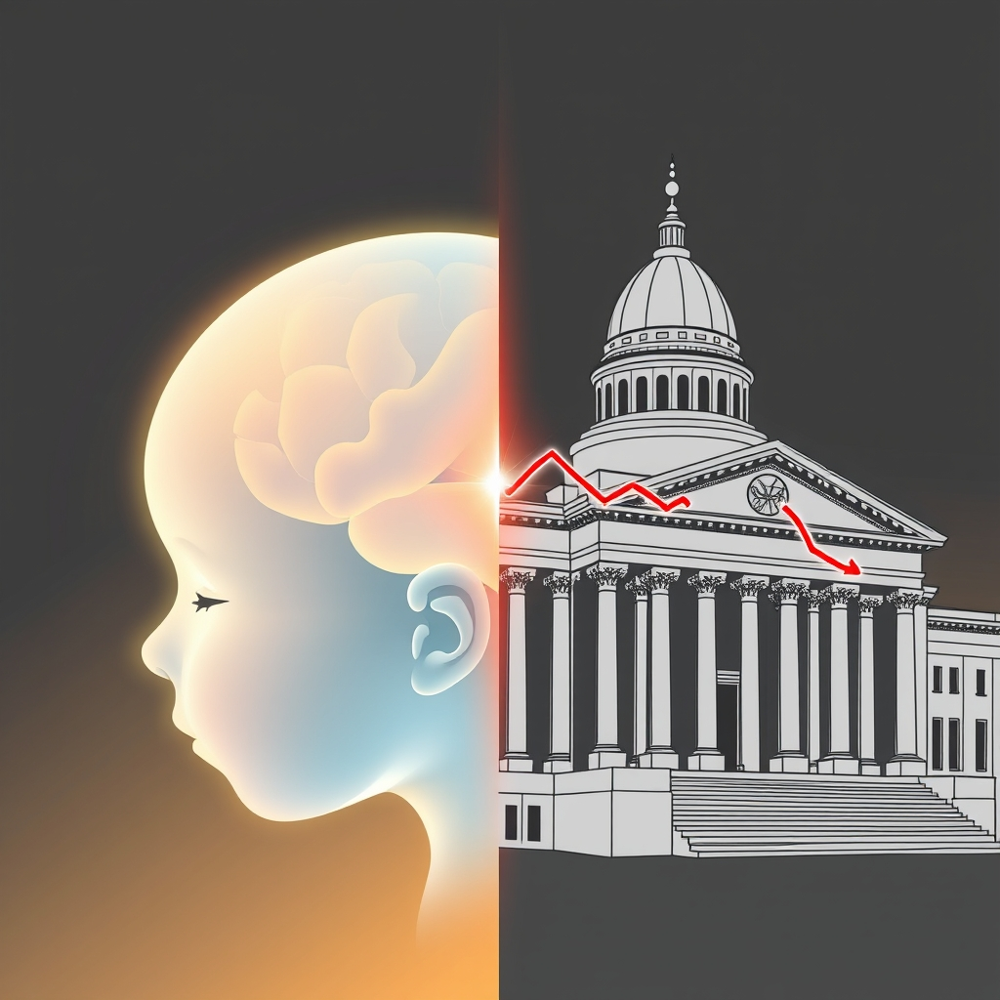

[Home](../index.md) > [Reflections](./index.md) | [⏮️](./2025-03-13.md) [⏭️](./2025-03-15.md)  
# 2025-03-14 | 👶 Baby 🧠 Brains | 🏛️ Civil 📉 Disservice  
  
## 📚 Books  
- [📈⚙️♾️ The Goal: A Process of Ongoing Improvement](../books/the-goal.md)  
- [👶🧠📈📚 Developmental Science: An Advanced Textbook](../books/developmental-science.md)  
- [👶🧠🫨❓ What's Going On in There?: How the Brain and Mind Develop in the First Five Years of Life](../books/whats-going-on-in-there.md)  
  
## 📰 News  
- [The history of civil service and the impact of Trump's slashing of the workforce](../videos/the-history-of-civil-service-and-the-impact-of-trumps-slashing-of-the-workforce.md)  
- [Brooks and Capehart on the Democratic division over the stopgap funding bill](../videos/brooks-and-capehart-on-the-democratic-division-over-the-stopgap-funding-bill.md)  
- [What America is losing as President Trump fires independent government watchdogs | 60 Minutes](../videos/what-america-is-losing-as-president-trump-fires-independent-government-watchdogs-60-minutes.md)