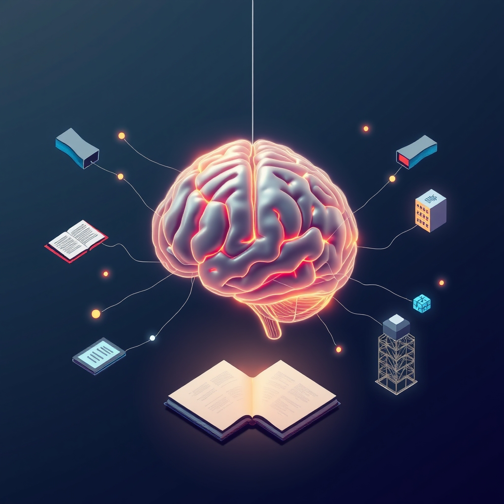

[Home](../index.md) > [Reflections](./index.md) | [⏮️](./2025-03-16.md) [⏭️](./2025-03-18.md)  
# 2025-03-17 | 🧠 Brains | 📚 Books | 🏗️ Builds  
  
## 🌌 Topics  
- [A Hierarchical View of Human Knowledge](../topics/a-hierarchical-view-of-human-knowledge.md)  
    - [Technology](../topics/technology.md)  
    - [Engineering](../topics/engineering.md)  
        - [Software Engineering](../topics/software-engineering.md)  
            - [Computer Science](../topics/computer-science.md)  
                - [Programming Languages](../topics/programming-languages.md)  
                    - [Functional Languages](../topics/functional-languages.md)  
            - [Software Testing and Quality Assurance](../topics/software-testing-and-quality-assurance.md)  
        - [Electrical Engineering](../topics/electrical-engineering.md)  
    - [Math](../topics/math.md)  
    - [Humanities](../topics/humanities.md)  
        - [Linguistics](../topics/linguistics.md)  
    - [Philosophy](../topics/philosophy.md)  
  
## 📚 Books  
- [How Google Tests Software](../books/how-google-tests-software.md)  
- [Foundations of Software Testing](../books/foundations-of-software-testing.md)  
- [Model Checking](../books/model-checking.md)  
- [Executive Function 'Dysfunction' - Strategies for Educators and Parents](../books/executive-function-dysfunction.md)  
- [Smart but Scattered](../books/smart-but-scattered.md)  
- [Taking Charge of Adult ADHD by Russell Barkley](../books/taking-charge-of-adult-adhd.md)  
- [Executive Functions: What They Are, How They Work, and Why They Evolved](../books/executive-functions.md)  
- [Executive Functions: Development, Assessment, and Intervention](../books/executive-functions-development-assessment-and-intervention.md)  
- [Principles of Neuropsychology](../books/principles-of-neuropsychology.md)  
- [The Brain That Changes Itself](../books/the-brain-that-changes-itself.md)  
- [Soft Wired: How the New Science of Brain Plasticity Can Change Your Life](../books/soft-wired-how-the-new-science-of-brain-plasticity-can-change-your-life.md)  
- [Spark: The Revolutionary New Science of Exercise and the Brain](../books/spark-the-revolutionary-new-science-of-exercise-and-the-brain.md)  
- [How to Change](../books/how-to-change.md)  
- [Elasticsearch: The Definitive Guide](../books/elasticsearch-the-definitive-guide.md)  
  
## 📺 Videos  
- [How to Become an Expert in ANYTHING - The Dunning Kruger Effect](../videos/how-to-become-an-expert-in-anything-the-dunning-kruger-effect.md)  
- [You're Not Stupid: How To Never Lose Focus Again](../videos/youre-not-stupid-how-to-never-lose-focus-again.md)  
  
## 💾 Software  
- [Elastic Search](../software/elastic-search.md)  
- [Redis](../software/redis.md)  
- [Ollama](../software/ollama.md)  
- [Open WebUI](../software/open-webui.md)  
