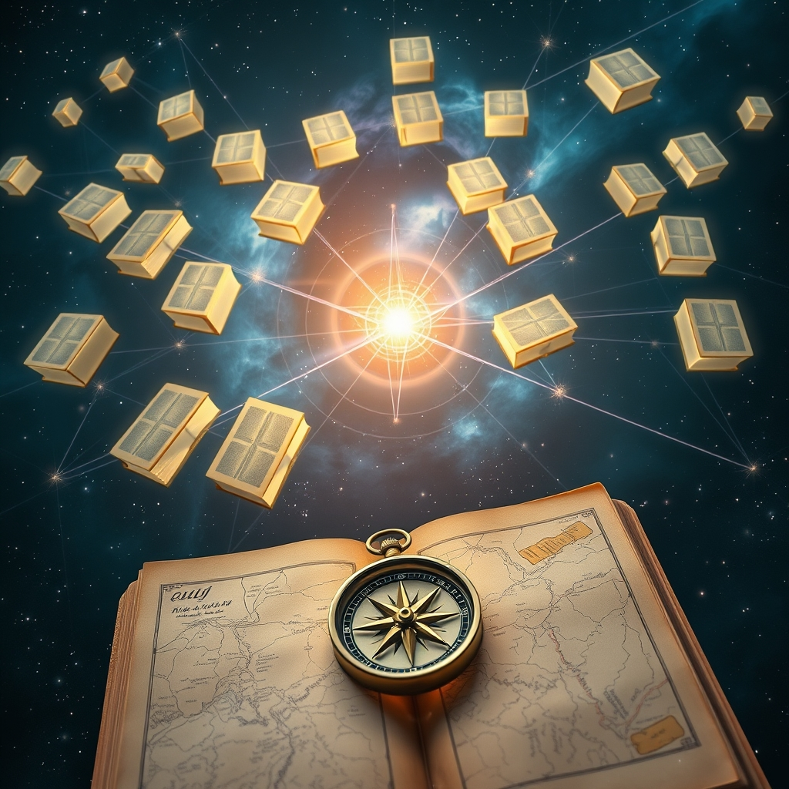

[Home](../index.md) > [Reflections](./index.md) | [⏮️](./2025-03-22.md) [⏭️](./2025-03-24.md)  
# 2025-03-23 | 🌐 Sitemaps | 🧭 Exploring 📚 Book 🌌 Space  
  
## 📚 Books  
- [🇯🇵🔑😊💯 Ikigai: The Japanese Secret to a Long and Happy Life](../books/ikigai.md)  
- [🔑🧭❤️ The Power of Meaning: Crafting a Life That Matters](../books/the-power-of-meaning.md)  
- [💰🧔👑🏛️ The Richest Man in Babylon](../books/the-richest-man-in-babylon.md)  
- [🧠📈💰 The Intelligent Investor: The Definitive Book on Value Investing](../books/the-intelligent-investor.md)  
- [🤏📜⏳ A Brief History of Time](../books/a-brief-history-of-time.md)  
  
## 🕷️ Google uses the last mod field on sitemaps  
> Google uses the `<lastmod>` value if it's consistently and verifiably (for example by comparing to the last modification of the page) accurate.  
- https://developers.google.com/search/docs/crawling-indexing/sitemaps/build-sitemap#additional-notes-about-xml-sitemaps  
  
## 📚 More thoughts on exploring book space  
_Previously: [reflections/2025-03-22 > 🌐 Networked Book Exploration 📚](./2025-03-22.md#🌐%20Networked%20Book%20Exploration%20📚)_  
### 🔍 Graph Search Perspective  
- 🗺️ This can be seen as a graph search problem.  
    - 📖 Each book is a node.  
    - 🔗 Relationships between books are edges.  
    - 🛠️ But we're dynamically constructing those relationships when we visit a node.  
    - 🔗 We can also link book nodes to other kinds of nodes, like:  
        - ✍️ authors  
        - 🏢 publishers  
        - 🏷️ topics  
    - 🌐 and then we can traverse the graph of topics, for example, if that helps us span the space of books.  
    - 📊 we can also describe books with a variety of attributes to consider along the way:  
        - 📈 popularity  
        - 📏 length  
        - 🧐 rigor  
  
### 🎯 Goal and Method  
- 🎯 A goal: iteratively explore book space traversing an implicit graph of relationships  
    - 🏆 maximize value in the collection of books identified  
- 📝 A method:  
    - 🤖 write a chatbot prompt parameterized by a book.  
    - 📚 the prompt should return more books.  
    - 🔄 each of those books can then be considered as inputs to the next prompt.  
  
### 🧭 Strategies and Heuristics  
- 🗺️ a strategy:  
    - 🗣️ prompt for:  
        - 📍 local exploration around the book's topic, perspective, etc.  
            - ✅ to be thorough  
        - 🌐 global exploration far from the book's topic, perspective, etc.  
            - 🌈 for breadth and diversity  
- 💡 a heuristic:  
    - 🔑 try to keep the prompt as simple as possible such that it will explore the full space of books when applied iteratively.  
  
### 🧪 An Attempt: 📚 Book Explorer  
> The following book covers  
> - one or more topics  
> - from one or more perspectives  
> - by one or more authors  
>   
> Please identify all of the above.  
>   
> Now given the topics covered, identify a unifying, thematic topic that tightly encompasses all of the topics in the book.  
>   
> We want to  
> - explore this unifying topic in more depth  
> - identify neighboring and parent topics for broader exploration  
>   
> Local exploration:  
> Given the parent topic, identify any sub topics that are not covered in this book. Recommend books that do cover these additional topics. Also recommend books that cover the same topic from a different perspective.  
>   
> Global exploration:  
> Given the parent topic P,  
> - think of a new topic: Q that is very dissimilar to P  
> - think of another new topic: R that is very dissimilar to both P and Q  
> - recommend books on topics Q and R  
> Meta Global Exploration:  
> - Recommend a book that is very dissimilar (in topic or perspective) from any book we've discussed so far.  
>   
> For fun, insert plenty of emojis throughout your response: at least one for every heading, bullet point and sentence and multiple interspersed through any large block of text.  
  
🏎️ And now for a test drive:  
## 🤖💬 Bot Chats  
- [📖 Book 🧭 Explorer 1](../bot-chats/book-explorer-1.md)