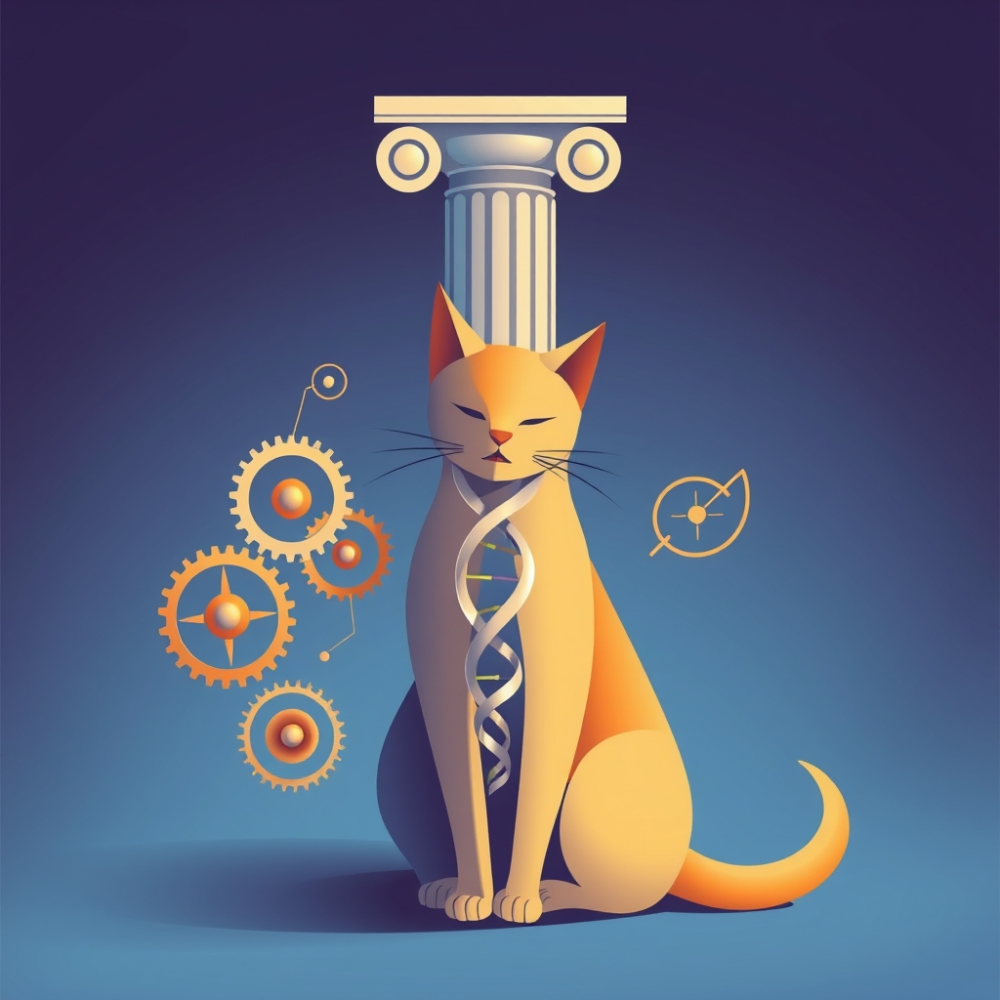

[Home](../index.md) > [Reflections](./index.md) | [⏮️](./2025-03-23.md) [⏭️](./2025-03-25.md)  
# 2025-03-24 | 🧬🐱 Cat Rx | 🌀 Sync ⏰ | 🏛️ Cuts ✂️  
  
## 📄 Articles  
- [Treatment of Feline Gastrointestinal Small-Cell Lymphoma With Chlorambucil and Glucocorticoids](../articles/treatment-of-feline-gastrointestinal-small-cell-lymphoma-with-chlorambucil-and-glucocorticoids.md)  
  
## 📚 Books  
- [🐕🐈‍⬛🩺❤️‍🩹 Small Animal Internal Medicine](../books/small-animal-internal-medicine.md)  
- [💥🌀➡️⏳⚖️🕰️ ️ Sync: How Order Emerges From Chaos In The Universe, Nature, And Daily Life](../books/sync.md)  
- [🌪️✨🕰️ Order Out of Chaos: Man's New Dialogue with Nature](../books/order-out-of-chaos.md)  
- [🧠🤔❓ Rationality: What It Is, Why It Seems Scarce, Why It Matters](../books/rationality.md)  
- [⚛️🌎 Beyond Weird: Why Everything You Thought You Knew about Quantum Physics Is Different](../books/beyond-weird.md)  
  
## 📰 News  
- [Brooks and Capehart on how voters are reacting to federal cuts](../videos/brooks-and-capehart-on-how-voters-are-reacting-to-federal-cuts.md)  
  
## 🌌 Topics  
- [Kuramoto Model](../topics/kuramoto-model.md)  
- [Self-Organization](../topics/self-organization.md)  
  
## 🦋 Bluesky    
<blockquote class="bluesky-embed" data-bluesky-uri="at://did:plc:i4yli6h7x2uoj7acxunww2fc/app.bsky.feed.post/3mo3tmyfej522" data-bluesky-cid="bafyreidknldxdzxtda4tzsvzwm7bz22yo5iwszdj22zqglwrx7dd5pfm5i">
2025-03-24 | 🧬🐱 Cat Rx | 🌀 Sync ⏰ | 🏛️ Cuts ✂️  
  
#AI Q: 🌀 Does order naturally emerge from chaos or require deliberate design?  
  
🩺 Veterinary Oncology | 🌀 Complexity Science | ⚛️ Quantum Mechanics | ⚖️ Logical  
https://bagrounds.org/reflections/2025-03-24
&mdash; <a href="https://bsky.app/profile/did:plc:i4yli6h7x2uoj7acxunww2fc?ref_src=embed">Bryan Grounds (@bagrounds.bsky.social)</a> <a href="https://bsky.app/profile/did:plc:i4yli6h7x2uoj7acxunww2fc/post/3mo3tmyfej522?ref_src=embed">2026-06-12T13:24:35.000Z</a></blockquote>