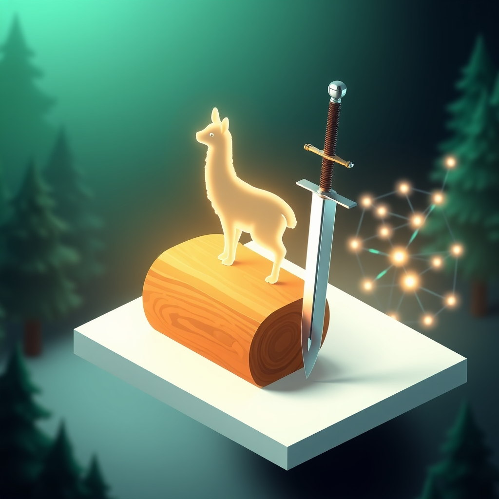

[Home](../index.md) > [Reflections](./index.md) | [⏮️](./2025-03-25.md) [⏭️](./2025-03-27.md)  
# 2025-03-26 | 🪵 Record 🦙 Reason 🗡️ Represent 🌐  
  
## 📄 Articles  
- [🪵 The Log: What every software engineer should know about real-time data's unifying abstraction](../articles/the-log-what-every-software%20engineer-should-know-about-real-time-datas-unifying-abstraction.md)  
  
## 📺 Videos  
- [💻🤖🏠📚 Ollama Course – Build AI Apps Locally](../videos/ollama-course-build-ai-apps-locally.md)  
- [✏️🗂️⏱️✨ The Excalidraw Obsidian Showcase 57 key features in just 17 minutes](../the-excalidraw-obsidian-showcase-57-key-features-in-just-17-minutes.md)  
  
## 🌌 Topics  
- [💻🎨⚙️ ANSI escape codes](../topics/ansi-escape-codes.md)  
- [🧠🌐 Knowledge Graphs](../topics/knowledge-graphs.md)  
- [🌳🗺️🔗🏛️ Ontologies](../topics/ontologies.md)  
  
## 💾 Software  
- [🎨🧱 Graphiti](../software/graphiti.md)  
  
## 📚 Books  
- [🧠🔗🤔💡 Knowledge Representation and Reasoning](../books/knowledge-representation-and-reasoning.md)