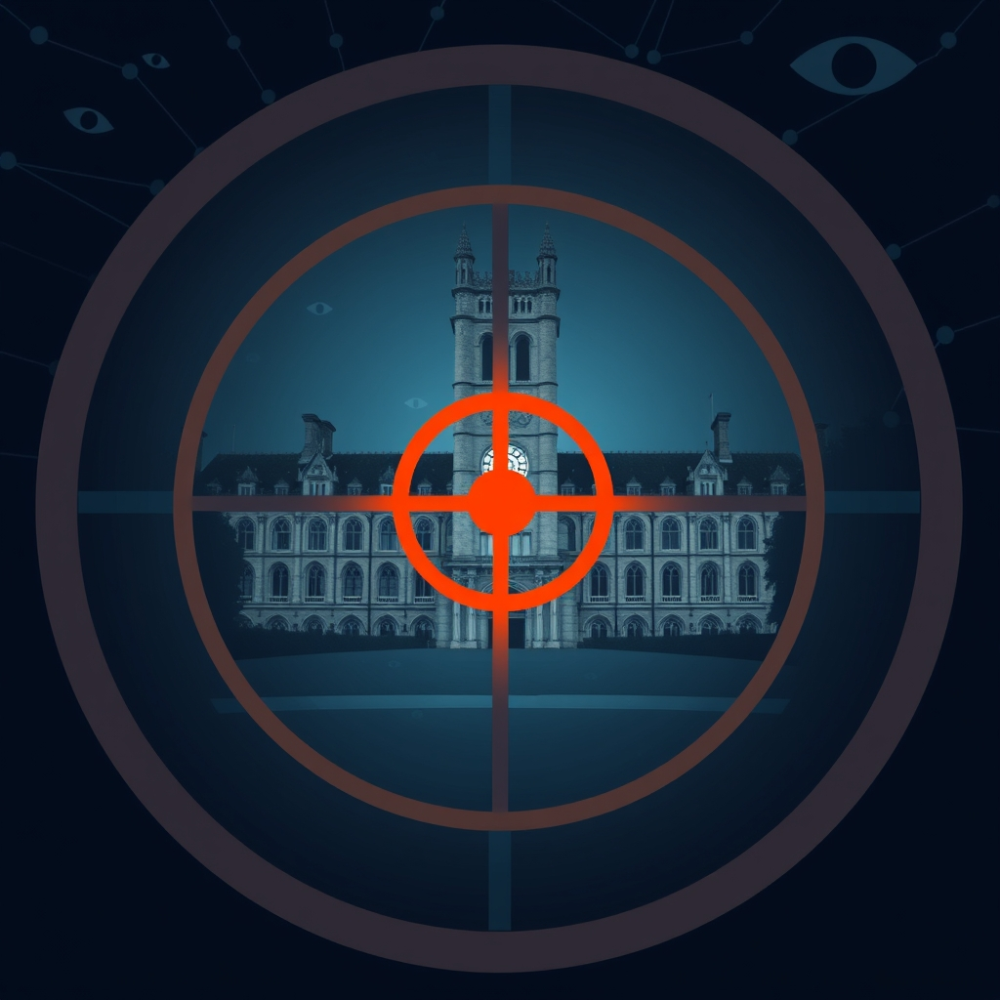

[Home](../index.md) > [Reflections](./index.md) | [⏮️](./2025-04-02.md) [⏭️](./2025-04-04.md)  
# 2025-04-03 | 🎯 Disrupting 🎓  
  
## 🗣️ Quotes  
> Every strongman targets universities with informers who report on students, faculty, and staff.  
- [Strongmen: Mussolini to the Present](../books/strongmen.md)  
  
## 📰 News  
- [How the Ph.D. Project, and 45 colleges, became a target of the Trump administration](../articles/how-the-phd-project-and-45-colleges-became-a-target-of-the-trump-administration.md)  
- [A look at the people ensnared in Trump’s campaign against pro-Palestinian activism at US colleges](https://apnews.com/article/immigration-detainees-students-ozturk-khalil-78f544fb2c8b593c88a0c1f0e0ad9c5f)  
- [More than 50 universities face federal investigations as part of Trump’s anti-DEI campaign](https://apnews.com/article/trump-dei-universities-investigated-f89dc9ec2a98897577ed0a6c446fae7b)  
