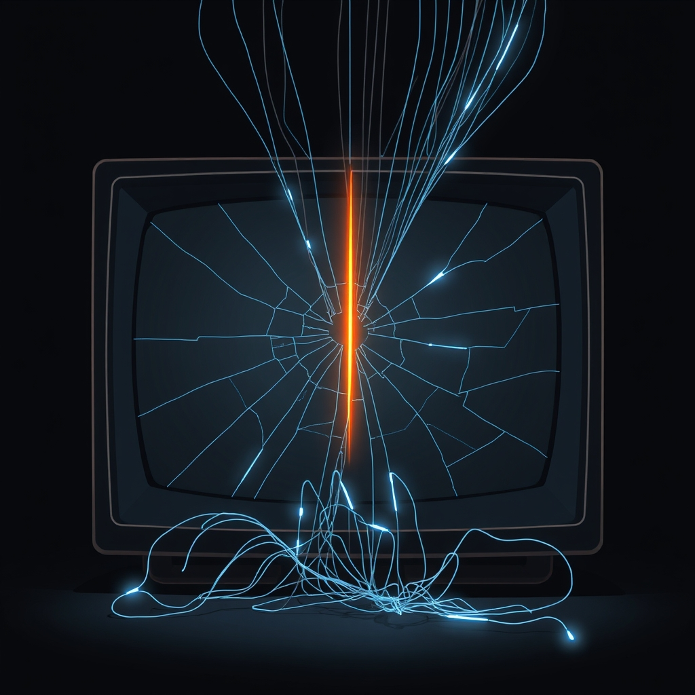

[Home](../index.md) > [Reflections](./index.md) | [⏮️](./2025-04-17.md) [⏭️](./2025-04-19.md)  
# 2025-04-18 | 🤥📣 Propaganda 🇷🇺🇺🇸  
  
## 📚 Books  
- [🥱🤓 Bored and Brilliant: How Spacing Out Can Unlock Your Most Productive and Creative Self](../books/bored-and-brilliant.md)  
- [🤥📣 This Is Not Propaganda: Adventures in the War Against Reality](../books/this-is-not-propaganda.md)  
- [🤯 Mindf*ck: Cambridge Analytica and the Plot to Break America](../books/mindf-ck-cambridge-analytica-and-the-plot-to-break-america.md)  
- [🏆📰📣 How to Win an Information War: The Propagandist Who Outwitted Hitler](../books/how-to-win-an-information-war.md)  
- [📰⚔️🧠 Information Wars: How We Lost the Global Battle Against Disinformation and What We Can Do About It](../books/information-wars.md)  
  
## 📰 News  
- ['Lab Leak,' a flashy page on the virus' origins, replaces government COVID sites]()  
> The website presents five bullet points in favor of the lab leak theory. None of them are new, noted Angela Rasmussen, a virologist at the University of Saskatchewan in Canada.  
> "Every one of the five pieces of evidence supporting the lab leak hypothesis … is factually incorrect, embellished, or presented in a misleading way," Rasmussen wrote in an email.  
> "But making evidence-based arguments in good faith about the pandemic's origin is not the purpose of this document. This is pure propaganda, intended to justify the systematic devastation of the federal government, particularly programs devoted to public health and biomedical research," Rasmussen added.  
