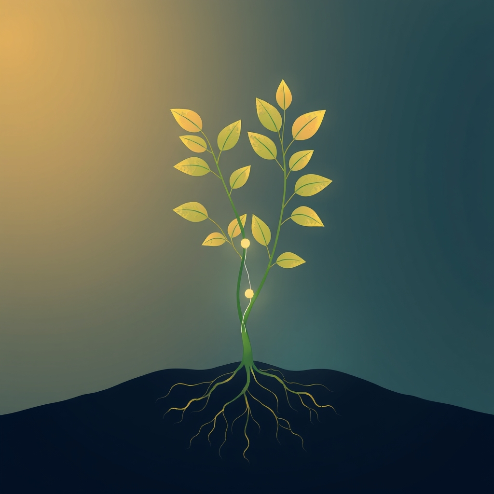

[Home](../index.md) > [Reflections](./index.md) | [⏮️](./2025-04-25.md) [⏭️](./2025-04-27.md)  
# 2025-04-26 | 🌿 Botany of 🫂 Attachment  
  
## 🌌 Topics  
- [🫂💖 Attachment Theory](../topics/attachment-theory.md)  
  
## 📚 Books  
### 🧑‍❤️‍🧑 Attachment Theory  
- [🧑‍❤️‍🧑🔗 Attached: The New Science of Adult Attachment and How It Can Help You Find - and Keep - Love](../books/attached-the-new-science-of-adult-attachment-and-how-it-can-help-you-find-and-keep-love.md)  
- [📖🫂🥼 Handbook of Attachment: Theory, Research, and Clinical Applications](../books/handbook-of-attachment-theory-research-and-clinical-applications.md)  
- [👨‍👩‍👧‍👦🛡️ A Secure Base: Parent-Child Attachment and Healthy Human Development](../books/a-secure-base-parent-child-attachment-and-healthy-human-development.md)  
- [👶🤔 Patterns of Attachment: A Psychological Study of the Strange Situation](../books/patterns-of-attachment-a-psychological-study-of-the-strange-situation.md)  
- [🧠🧑‍🤝‍🧑 The Developing Mind: How Relationships and the Brain Interact to Shape Who We Are](../books/the-developing-mind-how-relationships-and-the-brain-interact-to-shape-who-we-are.md)  
  
### 🪴 Gardening  
- [🪴 RHS How to Garden When You're New to Gardening: The Basics For Beginners](../books/rhs-how-to-garden-when-youre-new-to-gardening-the-basics-for-beginners.md)  
- [🌿🧑‍🌾 Botany for Gardeners](../books/botany-for-gardeners.md)  
- [🧑‍🌾🌿 A Gardener's Guide to Botany](../books/a-gardeners-guide-to-botany.md)  
- [🗓️🌷 RHS Gardening Through the Year](../books/rhs-gardening-through-the-year.md)  
- [🌍🌿 Gaia's Garden: A Guide to Home-Scale Permaculture](../books/gaias-garden.md)  
- [🍎🌳 Edible Forest Gardens](../books/edible-forest-gardens.md)  
