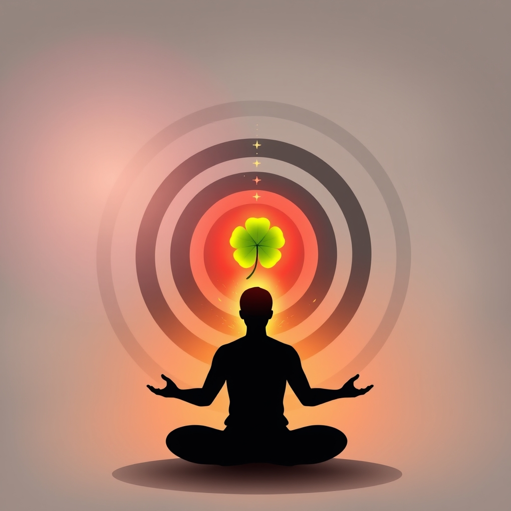

[Home](../index.md) > [Reflections](./index.md) | [⏮️](./2025-04-26.md) [⏭️](./2025-04-28.md)  
# 2025-04-27 | 🍀❤️‍🔥 Intentional 1 🧘🎯  
  
## 🔗 Related  
- [2025-04-30 | 🍀❤️‍🔥 Intentional 2 🧘🎯](./2025-04-30.md)  
  
## 📚 Books  
- [🍀⁉️ Fluke: Chance, Chaos, and Why Everything We Do Matters](../books/fluke-chance-chaos-and-why-everything-we-do-matters.md)  
- [❤️‍🔥💪 Grit: The Power of Passion and Perseverance](../books/grit-the-power-of-passion-and-perseverance.md)  
- [🎯🧠 The Motivated Brain: What Neuroscience Reveals About the Power of Purpose](../books/the-motivated-brain-what-neuroscience-reveals-about-the-power-of-purpose.md)  
  
## 🤖💬 Bot Chats  
- [🔥 Motivation & 🧘Discipline](../bot-chats/motivation-and-discipline.md)  
