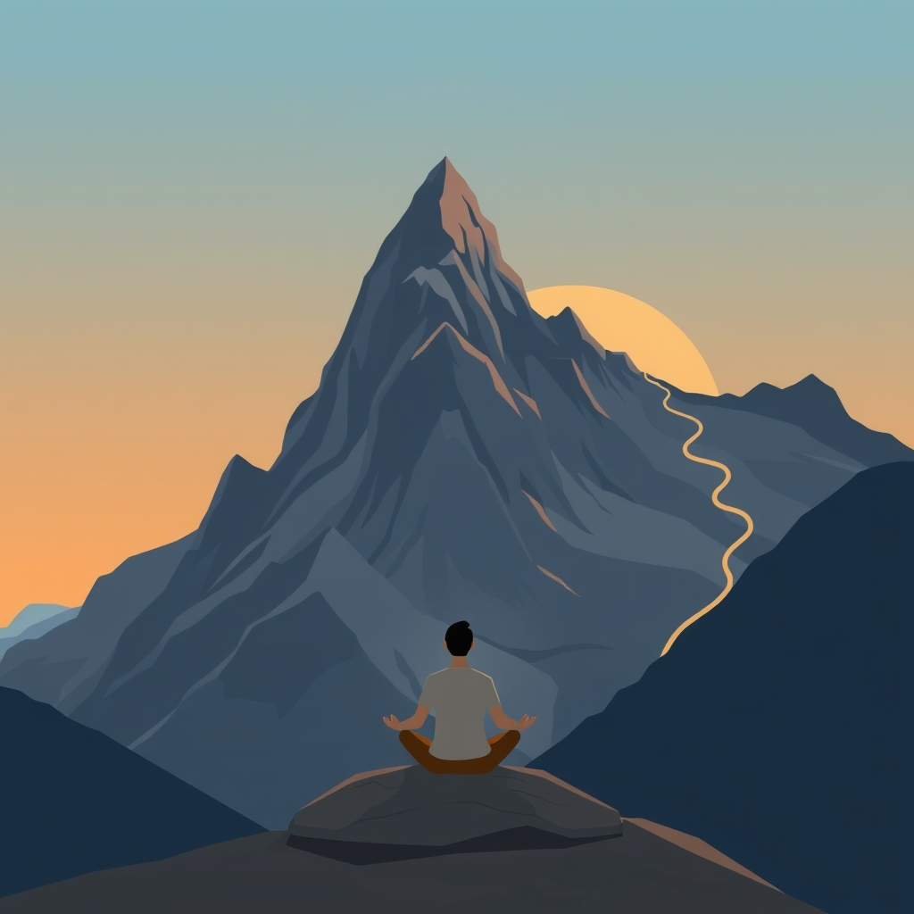

[Home](../index.md) > [Reflections](./index.md) | [⏮️](./2025-04-27.md) [⏭️](./2025-04-29.md)  
# 2025-04-28 | 🏔️ Discipline 🧘  
  
## 📚 Books  
- [🧘🟰🕊️ Discipline Equals Freedom: Field Manual](../books/discipline-equals-freedom-field-manual.md)  
- [🤔🧘 Meditations](../books/meditations.md)  
- [🧑‍🤝‍🧑📈 10 to 25: The Science of Motivating Young People: A Groundbreaking Approach to Leading the Next Generation - And Making Your Own Life Easier](../books/10-to-25-the-science-of-motivating-young-people-a-groundbreaking-approach-to-leading-the-next-generation-and-making-your-own-life-easier.md)  
- [📈➕ The Compound Effect](../books/the-compound-effect.md)  
- [🍬⏳ The Marshmallow Test: Mastering Self-Control](../books/the-marshmallow-test-mastering-self-control.md)  
- [🧘🎯 Mindful Self-Discipline: Living with Purpose and Achieving Your Goals in a World of Distractions](../books/mindful-self-discipline-living-with-purpose-and-achieving-your-goals-in-a-world-of-distractions.md)  
- [⬆️💪 The Upside of Stress: Why Stress Is Good for You, and How to Get Good at It](../books/the-upside-of-stress-why-stress-is-good-for-you-and-how-to-get-good-at-it.md)  
- [🧘🏋️ The Willpower Instinct: How Self-Control Works, Why It Matters, and What You Can Do to Get More of It](../books/the-willpower-instinct.md)  
