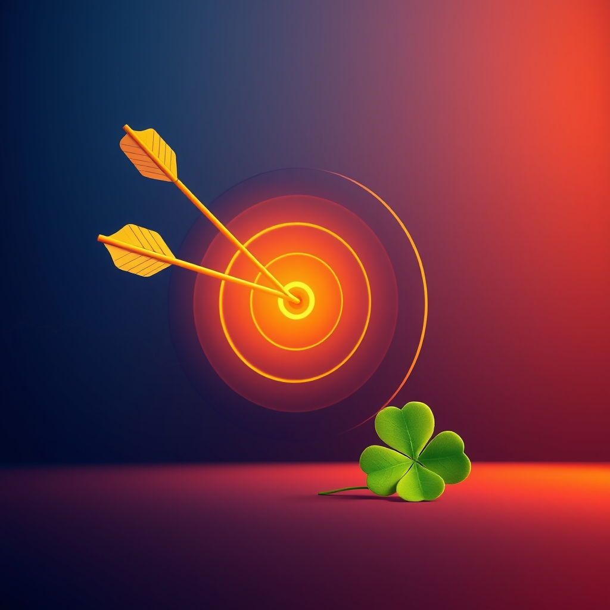

[Home](../index.md) > [Reflections](./index.md) | [⏮️](./2025-04-29.md) [⏭️](./2025-05-01.md)  
# 2025-04-30 | 🍀❤️‍🔥 Intentional 2 🧘🎯  
  
## 🔗 Related  
- [2025-04-27 | 🍀❤️‍🔥 Intentional 1 🧘🎯](./2025-04-27.md)  
  
## 🤖💬 Bot Chats  
- [🔥 Motivation & 🧘 Discipline](../bot-chats/motivation-and-discipline.md)  
  
## 📚 Books  
### 🧠 Neuroscience & Self-Discipline  
- [🧠🧘🏼‍♀️ Neuro-Discipline: Everyday Neuroscience for Self-Discipline, Focus, and Defeating Your Brain's Impulsive and Distracted Nature](../books/neuro-discipline-everyday-neuroscience-for-self-discipline-focus-and-defeating-your-brains-impulsive-and-distracted-nature.md)  
- [💪🧠 Level-Up Your Self-Discipline: Understand the Neuroscience of Self-Discipline, Control Your Emotions, Overcome Procrastination, and Achieve Your Difficult Goals](../books/level-up-your-self-discipline-understand-the-neuroscience-of-self-discipline-control-your-emotions-overcome-procrastination-and-achieve-your-difficult-goals.md)  
- [🧠📖 The User's Guide to the Brain: Perception, Attention, and the Four Theaters of the Mind](../books/the-users-guide-to-the-brain-perception-attention-and-the-four-theaters-of-the-mind.md)  
- [🧐🕹️🔁 Psycho-Cybernetics: A New Way to Get More Living Out of Life](../books/psycho-cybernetics-a-new-way-to-get-more-living-out-of-life.md)  
  
### 💪 Productivity & Motivation  
- [🧘🏋️ The Willpower Instinct: How Self-Control Works, Why It Matters, and What You Can Do to Get More of It](../books/the-willpower-instinct.md)  
- [🔥📜 The Motivation Manifesto: 9 Declarations to Claim Your Personal Power](../books/the-motivation-manifesto-9-declarations-to-claim-your-personal-power.md)  
- [😊✅ Feel Good Productivity: How to Do More of What Matters to You](../books/feel-good-productivity-how-to-do-more-of-what-matters-to-you.md)  
- [🙈⚡🔬🌌 Hidden Potential: The Science of Achieving Greater Things](../books/hidden-potential-the-science-of-achieving-greater-things.md)  
  
### 🧘 Rest & Burnout  
- [🥵🔥💨 Burnout: The Secret to Unlocking the Stress Cycle](../books/burnout-the-secret-to-unlocking-the-stress-cycle.md)  
- [🚀📈🧘 Peak Performance: Elevate Your Game, Avoid Burnout, and Thrive with the New Science of Success](../books/peak-performance-elevate-your-game-avoid-burnout-and-thrive-with-the-new-science-of-success.md)  
- [🌴🧘🏼‍♀️ Do Nothing: How to Break Away from Overworking, Overdoing, and Underliving](../books/do-nothing-how-to-break-away-from-overworking-overdoing-and-underliving.md)  
- [😴📈 Rest: Why You Get More Done When You Work Less](../books/rest-why-you-get-more-done-when-you-work-less.md)  
- [🥶🛌 Wintering: The Power of Rest and Retreat in Difficult Times](../books/wintering-the-power-of-rest-and-retreat-in-difficult-times.md)  
  
### 😊 Fulfillment  
- [😊🧠 Satisfaction: The Science of Finding True Fulfillment](../books/satisfaction-the-science-of-finding-true-fulfillment.md)  
