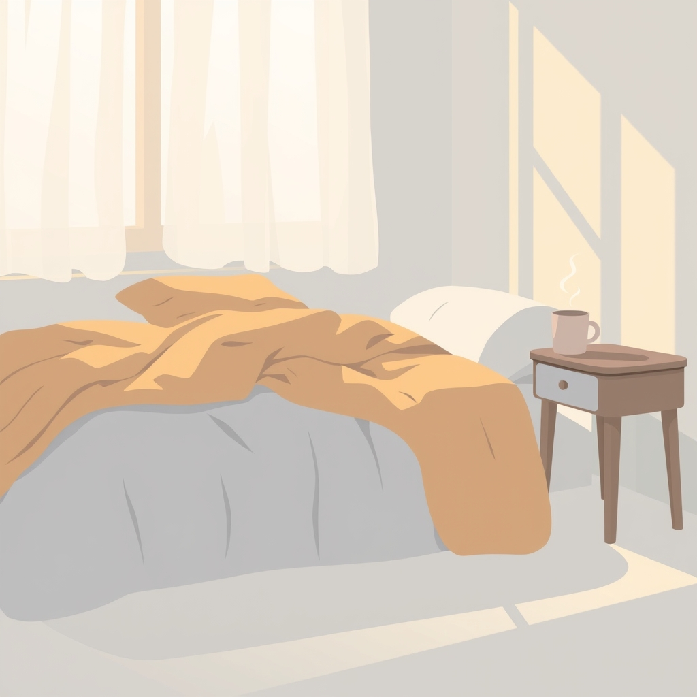

[Home](../index.md) > [Reflections](./index.md) | [⏮️](./2025-04-30.md) [⏭️](./2025-05-02.md)  
# 2025-05-01 | 🥱 1 Tired 😴  
  
## 🔗 Related  
- [2025-05-02 | 🥱 2 Tired 😴](./2025-05-02.md)  
- [2025-05-06 | 🥱 3 Tired 😴](./2025-05-06.md)  
  
## 🤖💬 Bot Chats  
- [🥱👎 How To Not Be Tired](../bot-chats/how-to-not-be-tired.md)  
  
## 📚 Books  
- [😴💭 Why We Sleep: Unlocking the Power of Sleep and Dreams](../books/why-we-sleep-unlocking-the-power-of-sleep-and-dreams.md)  
- [🍎⚡ Eat for Energy: How to Beat Fatigue, Supercharge Your Mitochondria, and Unlock All-Day Energy](../books/eat-for-energy-how-to-beat-fatigue-supercharge-your-mitochondria-and-unlock-all-day-energy.md)