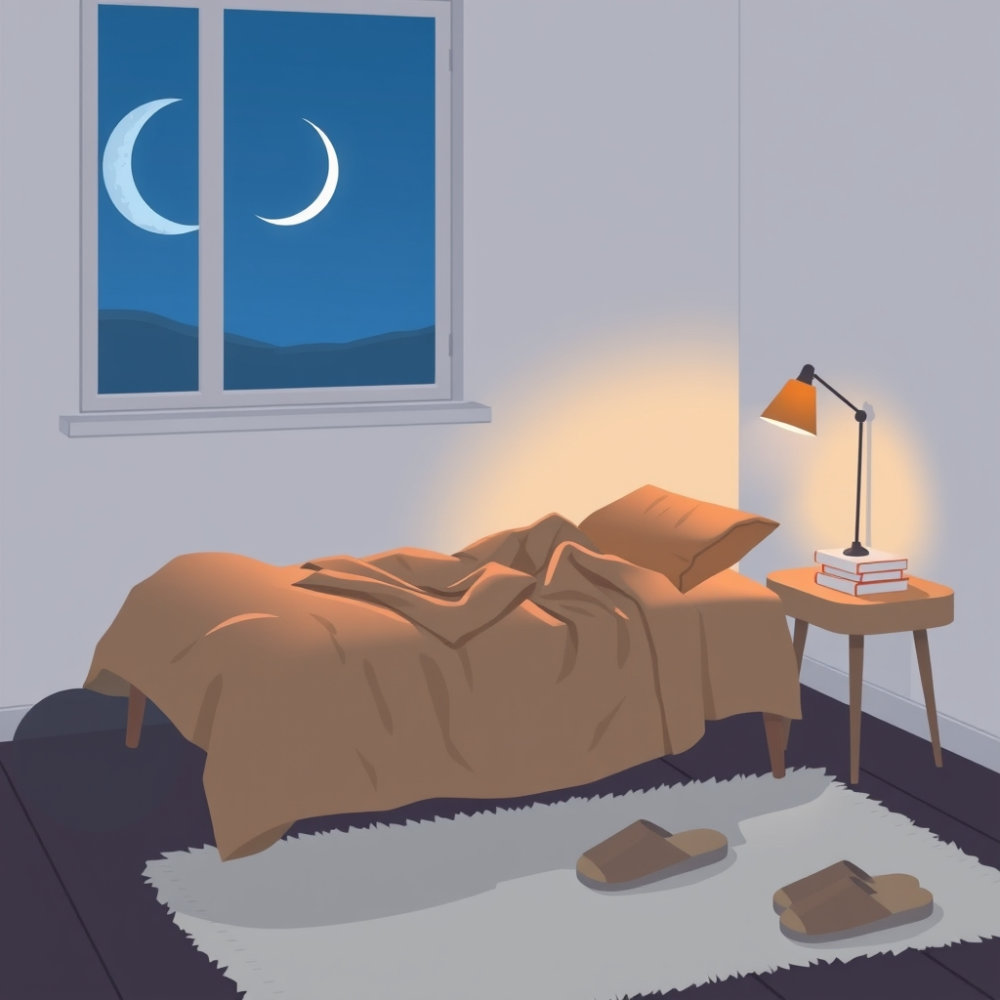

[Home](../index.md) > [Reflections](./index.md) | [⏮️](./2025-05-01.md) [⏭️](./2025-05-03.md)  
# 2025-05-02 | 🥱 2 Tired 😴  
  
## 🔗 Related  
- [2025-05-01 | 🥱 1 Tired 😴](./2025-05-01.md)  
- [2025-05-06 | 🥱 3 Tired 😴](./2025-05-06.md)  
  
## 🤖💬 Bot Chats  
- [🥱👎 How To Not Be Tired](../bot-chats/how-to-not-be-tired.md)  
  
## 📚 Books  
- [⚡❤️‍🩹 Good Energy: The Surprising Connection Between Metabolism and Limitless Health](../books/good-energy-the-surprising-connection-between-metabolism-and-limitless-health.md)  
- [🌄⏳ The Circadian Code: Lose Weight, Supercharge Your Energy, and Transform Your Health from Morning to Midnight](../books/the-circadian-code.md)  
- [😴🧠 Sleepyhead: The Neuroscience of a Good Night's Rest](../books/sleepyhead-the-neuroscience-of-a-good-nights-rest.md)  
- [🧠❤️🔄 The Neuroscience of Change: A Compassion-Based Program for Personal Transformation](../books/the-neuroscience-of-change-a-compassion-based-program-for-personal-transformation.md)  
- [😴🛠️ The Sleep Solution: Why Your Sleep is Broken and How to Fix It](../books/the-sleep-solution-why-your-sleep-is-broken-and-how-to-fix-it.md)