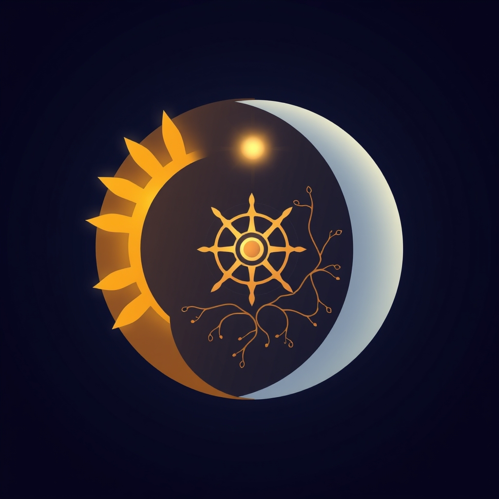

[Home](../index.md) > [Reflections](./index.md) | [⏮️](./2025-05-02.md) [⏭️](./2025-05-04.md)  
# 2025-05-03 | ⏰ Circadian 🌍  
  
## 📺 Videos  
- [⏰👵🔬 Circadian Code to Extend Longevity | Satchin Panda | TEDxVeniceBeach](../videos/circadian-code-to-extend-longevity-satchin-panda-tedx-venice-beach.md)  
  
## 📚 Books  
- [⏰👤 The Inner Clock: Living in Sync with Our Circadian Rhythms](../books/the-inner-clock-living-in-sync-with-our-circadian-rhythms.md)  
- [⏱️🍎 Time Restricted Eating: A Look into the Lifestyle](../books/time-restricted-eating-a-look-into-the-lifestyle.md)  
  
## 🦋 Bluesky    
<blockquote class="bluesky-embed" data-bluesky-uri="at://did:plc:i4yli6h7x2uoj7acxunww2fc/app.bsky.feed.post/3mnt3i2rrz42l" data-bluesky-cid="bafyreibidjhdaqyd3hh6nikzdiuyu4icbg7cs36tpuzzrayeadhr4fnch4">
2025-05-03 | ⏰ Circadian 🌍  
  
#AI Q: ⏰ Does aligning your daily schedule with biology actually improve your life?  
  
🧬 Chronobiology | 🍽️ Intermittent Fasting | ⏳ Longevity Science  
https://bagrounds.org/reflections/2025-05-03
&mdash; <a href="https://bsky.app/profile/did:plc:i4yli6h7x2uoj7acxunww2fc?ref_src=embed">Bryan Grounds (@bagrounds.bsky.social)</a> <a href="https://bsky.app/profile/did:plc:i4yli6h7x2uoj7acxunww2fc/post/3mnt3i2rrz42l?ref_src=embed">2026-06-09T01:51:02.000Z</a></blockquote>