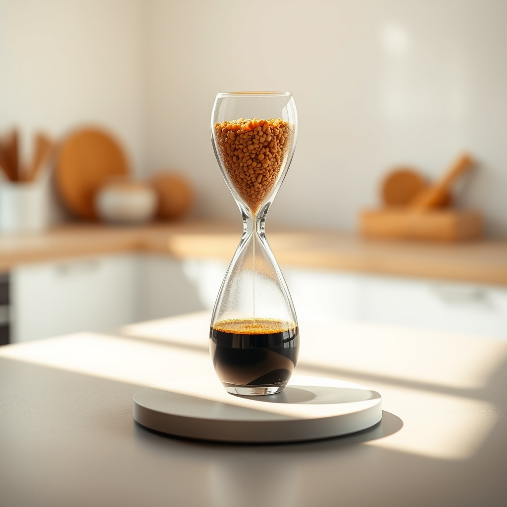

[Home](../index.md) > [Reflections](./index.md) | [⏮️](./2025-05-03.md) [⏭️](./2025-05-05.md)  
# 2025-05-04 | 🍽️ Intermittent ⌛  
  
## 🌌 Topics  
- [⏳🍽️ Time-Restricted Eating](../topics/time-restricted-eating.md)  
  
## 📺 Videos  
- [☕⛓️‍💥🚄❓ Does drinking coffee break your fast? | Satchin Panda](../videos/does-drinking-coffee-break-your-fast-satchin-panda.md)  
