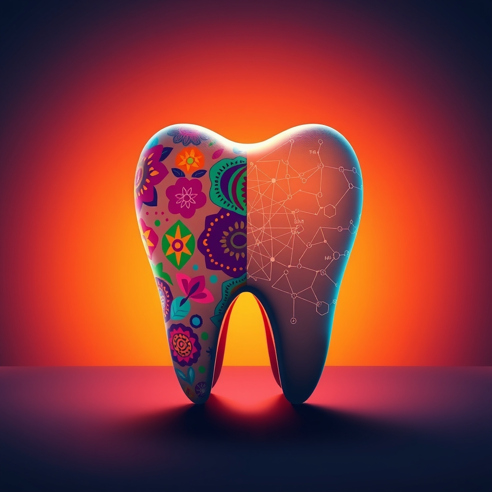

[Home](../index.md) > [Reflections](./index.md) | [⏮️](./2025-05-04.md) [⏭️](./2025-05-06.md)  
# 2025-05-05 | 🦷🔬 Cinco de Dientes 🇲🇽🇺🇸  
  
## 🤖💬 Bot Chats  
- [🦷🔬 Science of Dentistry](../bot-chats/science-of-dentistry.md)  
- [🇲🇽💃 Cinco de Mayo](../bot-chats/cinco-de-mayo.md)  
  
## 📚 Books  
- [🦷👶 Ten Cate's Oral Histology: Development, Structure, and Function](../books/ten-cates-oral-histology-development-structure-and-function.md)  
- [🇲🇽🇺🇸 Cinco de Mayo: An American Tradition](../books/cinco-de-mayo-an-american-tradition.md)