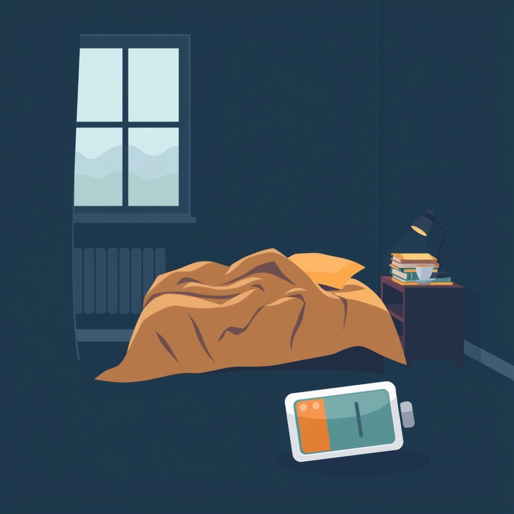

[Home](../index.md) > [Reflections](./index.md) | [⏮️](./2025-05-05.md) [⏭️](./2025-05-07.md)  
# 2025-05-06 | 🥱 3 Tired 😴  
  
## 🔗 Related  
- [2025-05-01 | 🥱 1 Tired 😴](./2025-05-01.md)  
- [2025-05-02 | 🥱 2 Tired 😴](./2025-05-02.md)  
## 🤖💬 Bot Chats  
- [🥱👎 How To Not Be Tired](../bot-chats/how-to-not-be-tired.md)  
  
## 📚 Books  
- [📖⏱️🍎 The Complete Guide to Fasting: Heal Your Body Through Intermittent, Alternate-Day, and Extended Fasting](../books/the-complete-guide-to-fasting-heal-your-body-through-intermittent-alternate-day-and-extended-fasting.md)  
- [🔋⚕️⏳ Mitochondria and the Future of Medicine: The Key to Understanding Disease, Chronic Illness, Aging, and Life Itself](../books/mitochondria-and-the-future-of-medicine-the-key-to-understanding-disease-chronic-illness-aging-and-life-itself.md)  
