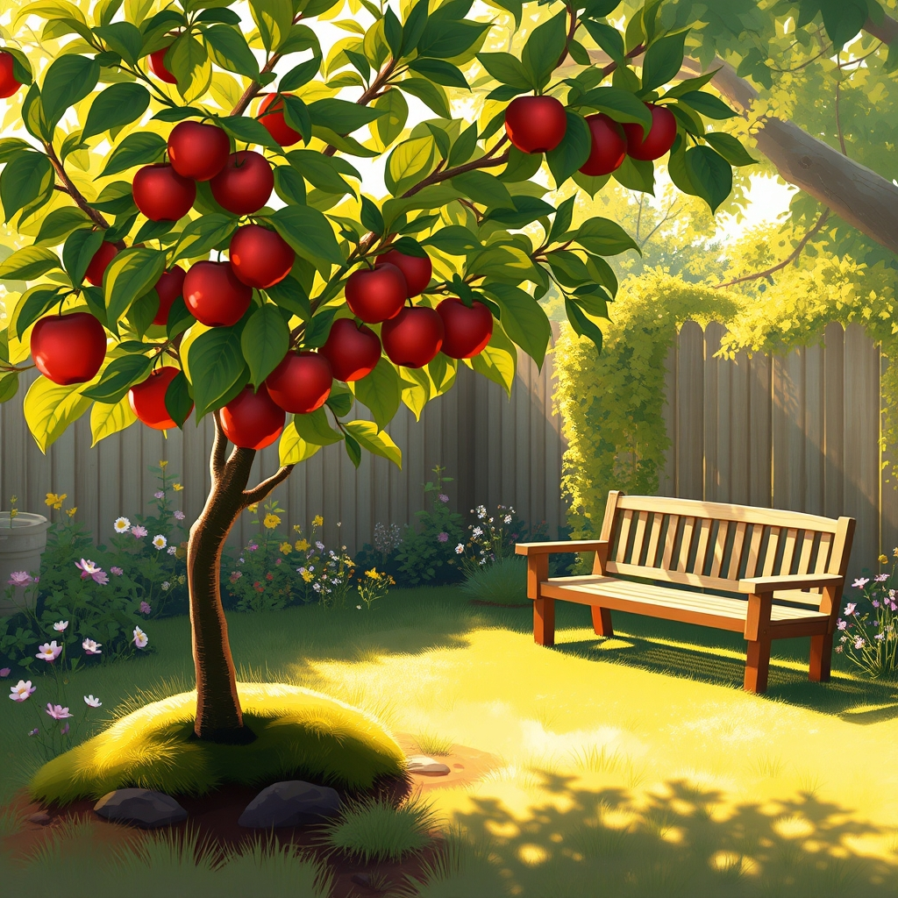

[Home](../index.md) > [Reflections](./index.md) | [⏮️](./2025-05-08.md) [⏭️](./2025-05-10.md)  
# 2025-05-09 | 🍎 Fruits 🌳 of 🧘🏼‍♀️ Change 🔄  
  
## 📚 Books  
### 🧘🏼‍♀️ Change 🔄  
- Finished [🧠❤️🔄 The Neuroscience of Change: A Compassion-Based Program for Personal Transformation](../books/the-neuroscience-of-change-a-compassion-based-program-for-personal-transformation.md)  
- Starting [🗓️➕ 40 Days to Positive Change: Daily Support to Create a New Habit](../books/40-days-to-positive-change-daily-support-to-create-a-new-habit.md)  
  
### 🍎 Fruit 🌳 Trees  
- [🏡🍎 The Backyard Orchardist: A Complete Guide to Growing Fruit Trees in the Home Garden](../books/the-backyard-orchardist-a-complete-guide-to-growing-fruit-trees-in-the-home-garden.md)  
- [🌳🍎🍽️ From Tree to Table: Growing Backyard Fruit Trees in the Pacific Maritime Climate](../books/from-tree-to-table-growing-backyard-fruit-trees-in-the-pacific-maritime-climate.md)  
- [🍓🌳 Growing Berries and Fruit Trees in the Pacific Northwest: How to Grow Abundant, Organic Fruit in Your Backyard](../books/growing-berries-and-fruit-trees-in-the-pacific-northwest-how-to-grow-abundant-organic-fruit-in-your-backyard.md)  
  
  
## 🤖💬 Bot Chats  
- [🏡🍎🌳📚 Home Fruit Tree Books](../bot-chats/fruit-tree-books.md)