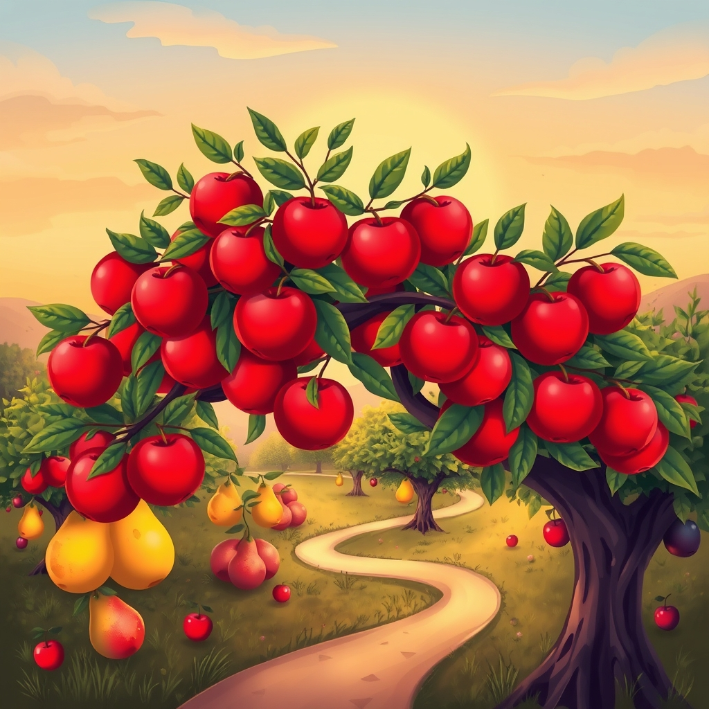

[Home](../index.md) > [Reflections](./index.md) | [⏮️](./2025-05-09.md) [⏭️](./2025-05-11.md)  
# 2025-05-10 | 🍎 Fruit 🌳 Trees  
  
## 🤖💬 Bot Chats  
- [🏡🍎🌳📚 Home Fruit Tree Books](../bot-chats/fruit-tree-books.md)  
  
## 📚 Books  
- [🌱🍎🌳 Growing Fruit Trees: 12 Simple Steps to Abundant Fruit Production and Reconnecting with the Food You Eat](../books/growing-fruit-trees-12-simple-steps-to-abundant-fruit-production-and-reconnecting-with-the-food-you-eat.md)  
- [🏡🍎🌳 The Home Orchard: Growing Your Own Deciduous Fruit and Nut Trees](../books/the-home-orchard-growing-your-own-deciduous-fruit-and-nut-trees.md)  
