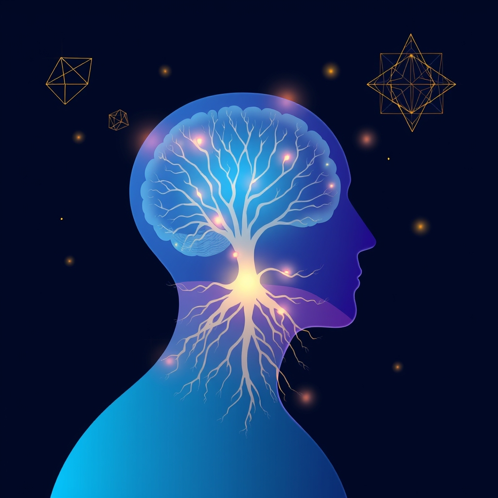

[Home](../index.md) > [Reflections](./index.md) | [⏮️](./2025-05-15.md) [⏭️](./2025-05-17.md)  
# 2025-05-16 | 🧠 Altered Traits 🧘🏼‍♀️  
  
## 📚 Books  
- [🔬🧘🏼‍♀️🧠 Altered Traits: Science Reveals How Meditation Changes Your Mind, Brain, and Body](../books/altered-traits-science-reveals-how-meditation-changes-your-mind-brain-and-body.md)