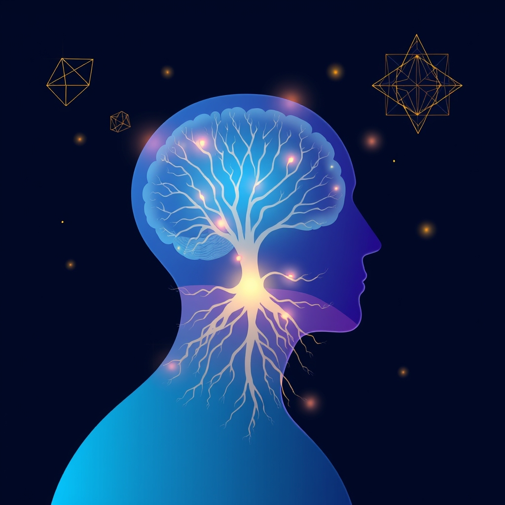

[Home](../index.md) > [Reflections](./index.md) | [⏮️](./2025-05-15.md) [⏭️](./2025-05-17.md)  
# 2025-05-16 | 🧠 Altered Traits 🧘🏼‍♀️  
  
## 📚 Books  
- [🔬🧘🏼‍♀️🧠 Altered Traits: Science Reveals How Meditation Changes Your Mind, Brain, and Body](../books/altered-traits-science-reveals-how-meditation-changes-your-mind-brain-and-body.md)  
  
## 🦋 Bluesky    
<blockquote class="bluesky-embed" data-bluesky-uri="at://did:plc:i4yli6h7x2uoj7acxunww2fc/app.bsky.feed.post/3ms4wyx3scc22" data-bluesky-cid="bafyreihyf6qlt35dsa2kf3wldmwyfriic4x5lls5v4kbygik4kztso4eli">
2025-05-16 | 🧠 Altered Traits 🧘🏼‍♀️  
  
#AI Q: 🧘 Can meditation truly reshape your personality?  
  
🧘 Mindfulness | 🔬 Neuroscience | ✨ Well-being  
https://bagrounds.org/reflections/2025-05-16
&mdash; <a href="https://bsky.app/profile/did:plc:i4yli6h7x2uoj7acxunww2fc?ref_src=embed">Bryan Grounds (@bagrounds.bsky.social)</a> <a href="https://bsky.app/profile/did:plc:i4yli6h7x2uoj7acxunww2fc/post/3ms4wyx3scc22?ref_src=embed">2026-08-02T21:38:24.000Z</a></blockquote>