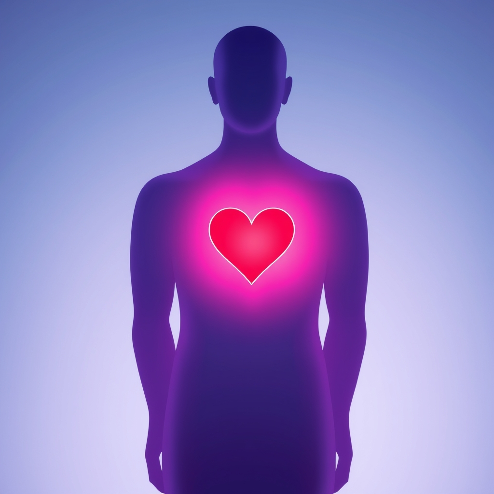

[Home](../index.md) > [Reflections](./index.md) | [⏮️](./2025-05-16.md) [⏭️](./2025-05-18.md)  
# 2025-05-17 | 🧩 Ackoff | 👤 Being | 🫂 Love ❤️  
  
## 👥 People  
- [🤔⚙️🗣️🤝💡🧩🔭📚👴 Russell Ackoff](../people/russell-ackoff.md)  
  
## 📚 Books  
- ▶️ Starting [👤🧠 Being You: A New Science of Consciousness](../books/being-you-a-new-science-of-consciousness.md)  
- ⏯️ Continuing [🗓️➕ 40 Days to Positive Change: Daily Support to Create a New Habit](../books/40-days-to-positive-change-daily-support-to-create-a-new-habit.md)  
- ▶️ Starting [🫂 Hold Me Tight: Seven Conversations for a Lifetime of Love](../books/hold-me-tight-seven-conversations-for-a-lifetime-of-love.md)  
- [❤️🧠 Love Sense: The Revolutionary New Science of Romantic Relationships](../books/love-sense-the-revolutionary-new-science-of-romantic-relationships.md)