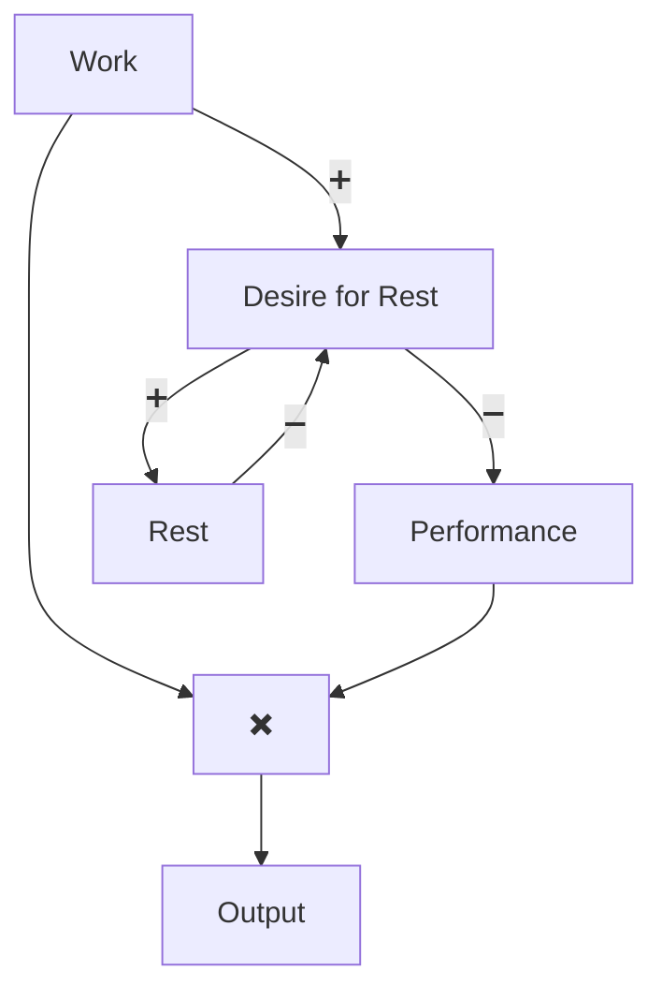

[Home](../index.md) > [Reflections](./index.md) | [⏮️](./2025-05-18.md) [⏭️](./2025-05-20.md)  
# 2025-05-19 | 🧠 Conscious 😴 Rest  
## 📚 Books  
- ⏯️ Continuing [👤🧠 Being You: A New Science of Consciousness](../books/being-you-a-new-science-of-consciousness.md)  
- 🪄 Generated [🌡️⚙️ Inventing Temperature: Measurement and Scientific Progress](../books/inventing-temperature-measurement-and-scientific-progress.md)  
  
## 🤔 Performance Levers  
- People intuit levers but push the wrong way.  
- Struggling at work?  
    - Intuition: work more -> burnout -> performance declines  
    - Counterintuitive: work less -> rest -> performance increases  
- Rest has negative (balancing) feedback.  
    - The more you rest, the less you want.  
  

