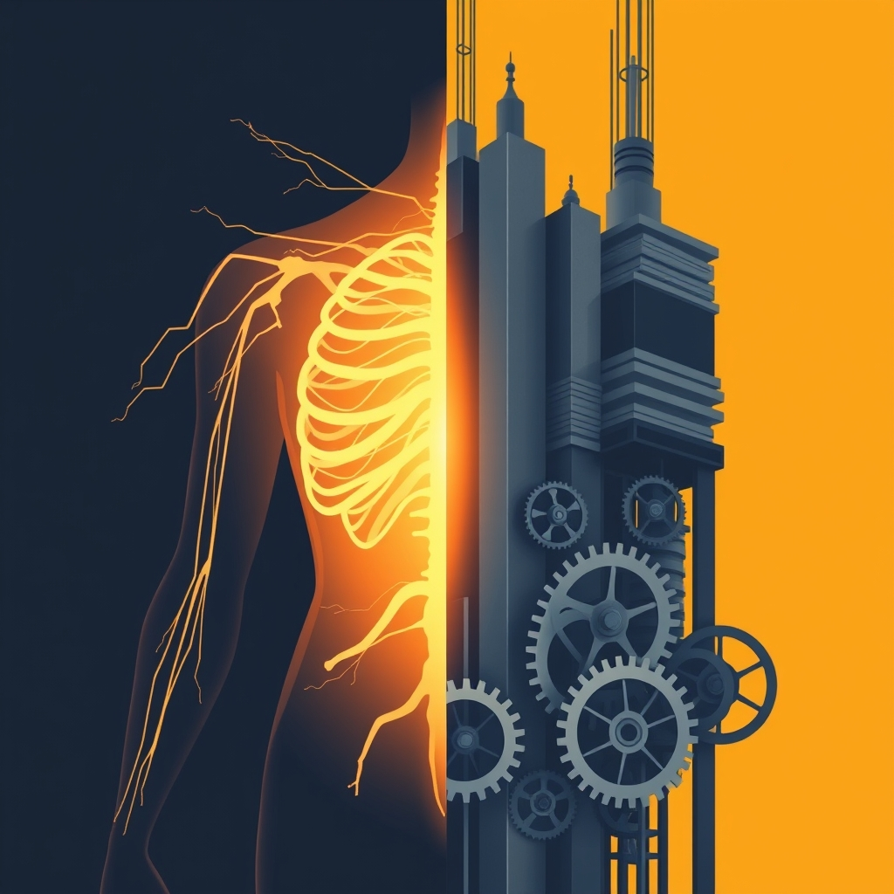

[Home](../index.md) > [Reflections](./index.md) | [⏮️](./2025-05-20.md) [⏭️](./2025-05-22.md)  
# 2025-05-21 | 👶🏼🙅🏼‍♀️🏥 Symptoms of ERISA 👿👔💹  
  
## 👥 People  
- [🧠🔬🧘‍♀️💪📈❤️‍🩹🗣️📚🌟 Kelly McGonigal](../people/kelly-mcgonigal.md)  
  
## 📚 Books  
- [🤕❤️ What if Symptoms Are Your Friend?: An Introduction to BodyMind Bridge and Your Self-Healing Mind](../books/what-if-symptoms-are-your-friend-an-introduction-to-bodymind-bridge-and-your-self-healing-mind.md)  
- [🏛️💻 ERISA: The Law and the Code](../books/erisa-the-law-and-the-code.md)  
- [🧑‍💼💰⚖️ Employee Benefits Law: ERISA and Beyond](../books/employee-benefits-law-erisa-and-beyond.md)  
- [🇺🇸❓📚 ERISA Law Answer Book](../books/erisa-law-answer-book.md)  
- [🧑‍⚖️❓ ERISA Benefits Litigation Answer Book](../books/erisa-benefits-litigation-answer-book.md)  
- [🧑‍💼✅ Case Studies In ERISA: Why It Matters And How It Benefits You](../books/case-studies-in-erisa-why-it-matters-and-how-it-benefits-you.md)  
- [🇺🇸⚖️ ERISA: Contemporary US Supreme Court Cases](../books/erisa-contemporary-us-supreme-court-cases.md)  
  
## 🦋 Bluesky    
<blockquote class="bluesky-embed" data-bluesky-uri="at://did:plc:i4yli6h7x2uoj7acxunww2fc/app.bsky.feed.post/3mv3g4dt3qs26" data-bluesky-cid="bafyreib7tosdruhi3ifm4l3tpnof3vqusfbtpdhv5kug2buqy3fgoin6ba">
2025-05-21 | 👶🏼🙅🏼‍♀️🏥 Symptoms of ERISA 👿👔💹  
  
#AI Q: 🏥 Should physical symptoms be viewed as messengers or just medical problems?  
  
⚖️ Legal Frameworks | 🧘 Self-Healing | 💼 Workplace Benefits  
https://bagrounds.org/reflections/2025-05-21
&mdash; <a href="https://bsky.app/profile/did:plc:i4yli6h7x2uoj7acxunww2fc?ref_src=embed">Bryan Grounds (@bagrounds.bsky.social)</a> <a href="https://bsky.app/profile/did:plc:i4yli6h7x2uoj7acxunww2fc/post/3mv3g4dt3qs26?ref_src=embed">2026-09-09T11:18:59.000Z</a></blockquote>