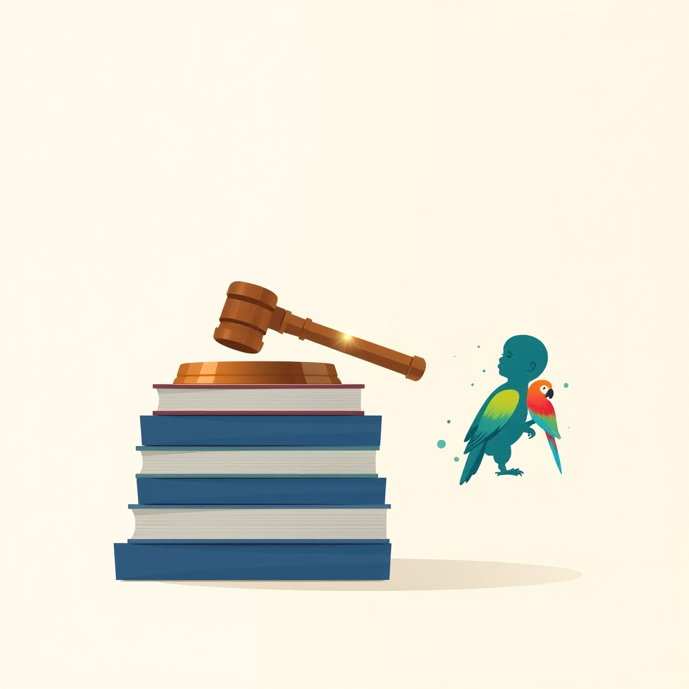

[Home](../index.md) > [Reflections](./index.md) | [⏮️](./2025-05-23.md) [⏭️](./2025-05-25.md)  
# 2025-05-24 | 🏥 Benefit ⚖️ | 🦜 Mimick 👶🏼  
  
  
## 📚 Books  
- [👨‍💼➕ Introduction to Employee Benefits Law](../books/introduction-to-employee-benefits-law.md)  
- [👶🗣️ How Babies Talk: The Magic and Mystery of Language in the First Three Years of Life](../books/how-babies-talk-the-magic-and-mystery-of-language-in-the-first-three-years-of-life.md)  
  
## 📺 Videos  
- [🗣️👽 How to Talk to Aliens](../videos/how-to-talk-to-aliens.md)  
- [🗣️💬🧠 Language Acquisition: Crash Course Linguistics  > 12](../videos/language-acquisition-crash-course-linguistics-12.md)  
  
## 🤖💬 Bot Chats  
- [🦜👶🏼 Mimicking Babies](../bot-chats/mimicking-babies.md)