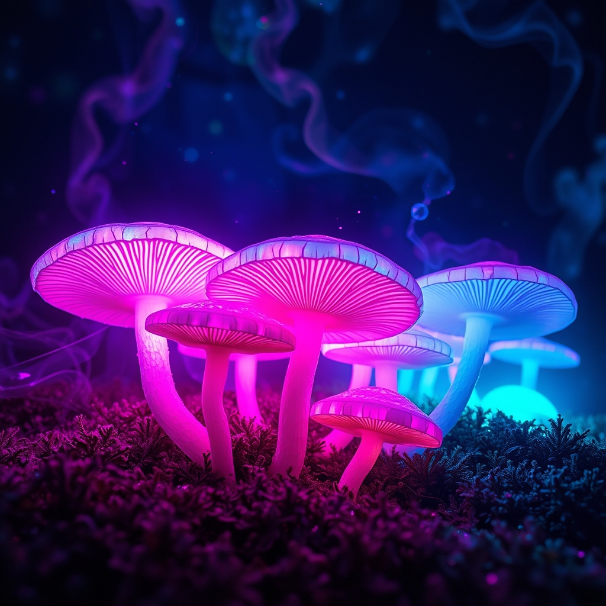

[Home](../index.md) > [Reflections](./index.md) | [⏮️](./2025-05-24.md) [⏭️](./2025-05-26.md)  
# 2025-05-25 | 🌈 Psychedelic 🍄  
  
  
## 📚 Books  
- [🧠🍄 How to Change Your Mind: What the New Science of Psychedelics Teaches Us About Consciousness, Dying, Addiction, Depression, and Transcendence](../books/how-to-change-your-mind-what-the-new-science-of-psychedelics-teaches-us-about-consciousness-dying-addiction-depression-and-transcendence.md)