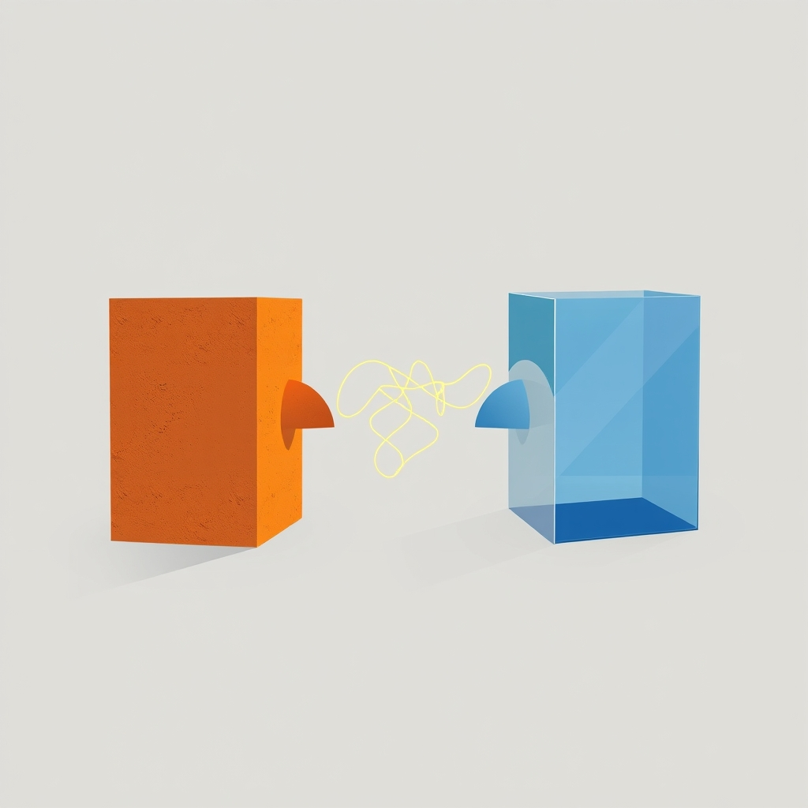

[Home](../index.md) > [Reflections](./index.md) | [⏮️](./2025-05-25.md) [⏭️](./2025-05-27.md)  
# 2025-05-26 | 🏗️ Creative 🙅🏼‍♀️ Conflict  
  
  
## 📚 Books  
- [💬😬 Difficult Conversations: How to Discuss What Matters Most](../books/difficult-conversations-how-to-discuss-what-matters-most.md)  
- [😠🤝 Disagree without Disrespect: How to Respectfully Debate with Those who Think, Believe and Vote Differently from You](../books/disagree-without-disrespect-how-to-respectfully-debate-with-those-who-think-believe-and-vote-differently-from-you.md)