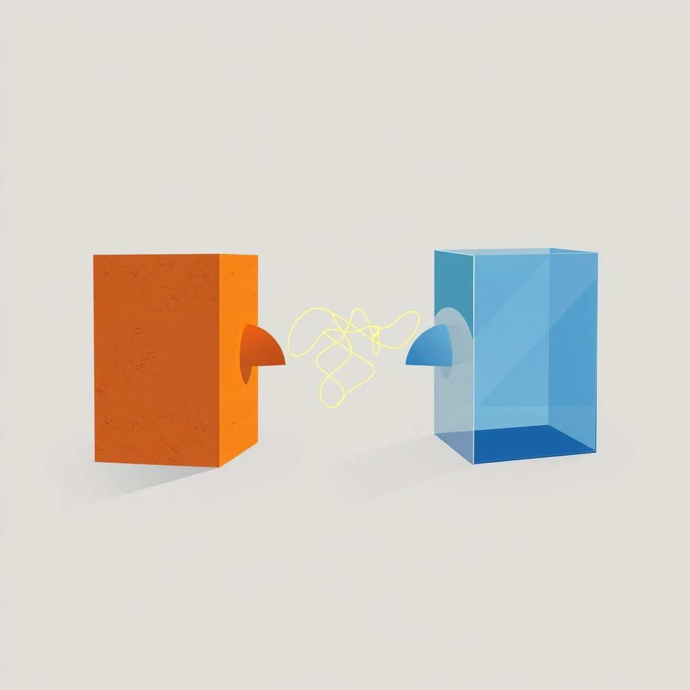

[Home](../index.md) > [Reflections](./index.md) | [⏮️](./2025-05-25.md) [⏭️](./2025-05-27.md)  
# 2025-05-26 | 🏗️ Creative 🙅🏼‍♀️ Conflict  
  
  
## 📚 Books  
- [💬😬 Difficult Conversations: How to Discuss What Matters Most](../books/difficult-conversations-how-to-discuss-what-matters-most.md)  
- [😠🤝 Disagree without Disrespect: How to Respectfully Debate with Those who Think, Believe and Vote Differently from You](../books/disagree-without-disrespect-how-to-respectfully-debate-with-those-who-think-believe-and-vote-differently-from-you.md)  
  
## 🦋 Bluesky    
<blockquote class="bluesky-embed" data-bluesky-uri="at://did:plc:i4yli6h7x2uoj7acxunww2fc/app.bsky.feed.post/3mspz7akwi72i" data-bluesky-cid="bafyreicajyx7fy4u6k2kigcaqs5gwc7ueonqumy3xia4t272luy4eip6xe">
2025-05-26 | 🏗️ Creative 🙅🏼‍♀️ Conflict  
  
#AI Q: 🤝 Can creative friction actually strengthen a relationship?  
  
💬 Dialogue | 🤝 Respectful Debate | 🧠 Emotional Intelligence  
https://bagrounds.org/reflections/2025-05-26
&mdash; <a href="https://bsky.app/profile/did:plc:i4yli6h7x2uoj7acxunww2fc?ref_src=embed">Bryan Grounds (@bagrounds.bsky.social)</a> <a href="https://bsky.app/profile/did:plc:i4yli6h7x2uoj7acxunww2fc/post/3mspz7akwi72i?ref_src=embed">2026-08-10T11:38:17.000Z</a></blockquote>