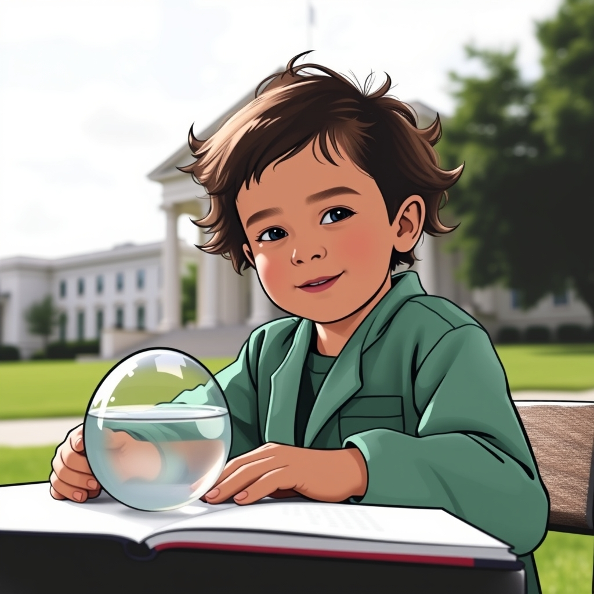

[Home](../index.md) > [Reflections](./index.md) | [⏮️](./2025-05-26.md) [⏭️](./2025-05-28.md)  
# 2025-05-27 | 🐐 Kid 🔬 Science 📚 | 📰 Republican 🐘 Theft 💸  
  
## 📚 Books  
- [🧪👶📈 Scientific Secrets for Raising Kids Who Thrive](../books/scientific-secrets-for-raising-kids-who-thrive.md)  
- [🌈🦎 A Color of His Own](../books/a-color-of-his-own.md)  
- ⏯️ Continuing [🧑‍⚖️📚 Law School for Everyone](../books/law-school-for-everyone.md)  
  
## 📰 News  
- [👹📜🏛️ Brooks and Capehart on House Republicans passing Trump's legislative agenda](../videos/brooks-and-capehart-on-house-republicans-passing-trumps-legislative-agenda.md)  
- [💰💣 What Trump’s ‘Big, Beautiful Bill’ Is Really Doing (Part 1) | The Ezra Klein Show](../videos/what-trumps-big-beautiful-bill-is-really-doing-part-1-the-ezra-klein-show.md)  
- [👹👶🏼💸➡️👴🏻💰 What Trump’s ‘Big, Beautiful Bill’ Is Really Doing (Part 2) | The Ezra Klein Show](../videos/what-trumps-big-beautiful-bill-is-really-doing-part-2-the-ezra-klein-show.md)  
- [🏛️📜💰🚨 Amy Walter and Jasmine Wright on how Senate Republicans feel about Trump's big bill](../videos/amy-walter-and-jasmine-wright-on-how-senate-republicans-feel-about-trumps-big-bill.md)  
  
## 🦋 Bluesky    
<blockquote class="bluesky-embed" data-bluesky-uri="at://did:plc:i4yli6h7x2uoj7acxunww2fc/app.bsky.feed.post/3msabd2pqvo26" data-bluesky-cid="bafyreictqkj337orw2pxqazxt45yfwiqkytuiatm4z2ytc2lxi2od23uxq">
2025-05-27 | 🐐 Kid 🔬 Science 📚 | 📰 Republican 🐘 Theft 💸  
  
#AI Q: ⚖️ Should politics or parenting be the priority in national debates?  
  
👶 Child Development | ⚖️ Legal Education | 🏛️ US Politics | 💸 Economic Policy  
https://bagrounds.org/reflections/2025-05-27
&mdash; <a href="https://bsky.app/profile/did:plc:i4yli6h7x2uoj7acxunww2fc?ref_src=embed">Bryan Grounds (@bagrounds.bsky.social)</a> <a href="https://bsky.app/profile/did:plc:i4yli6h7x2uoj7acxunww2fc/post/3msabd2pqvo26?ref_src=embed">2026-08-04T05:20:59.000Z</a></blockquote>