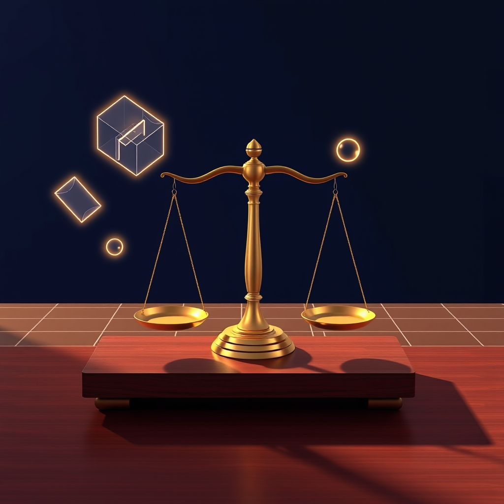

[Home](../index.md) > [Reflections](./index.md) | [⏮️](./2025-05-27.md) [⏭️](./2025-05-29.md)  
# 2025-05-28 | ⚖️ Lawgic 💭  
  
  
## 📚 Books  
- [🤔⚖️ Thinking Like a Lawyer: A New Introduction to Legal Reasoning](../books/thinking-like-a-lawyer-a-new-introduction-to-legal-reasoning.md)  
- [👩🏼‍⚖️💭🧮🏆 The Tools of Argument: How the Best Lawyers Think, Argue, and Win](../books/the-tools-of-argument-how-the-best-lawyers-think-argue-and-win.md)  
- [👩🏼‍⚖️⚖️💭🧮🗣️ Handbook of Legal Reasoning and Argumentation](../books/handbook-of-legal-reasoning-and-argumentation.md)