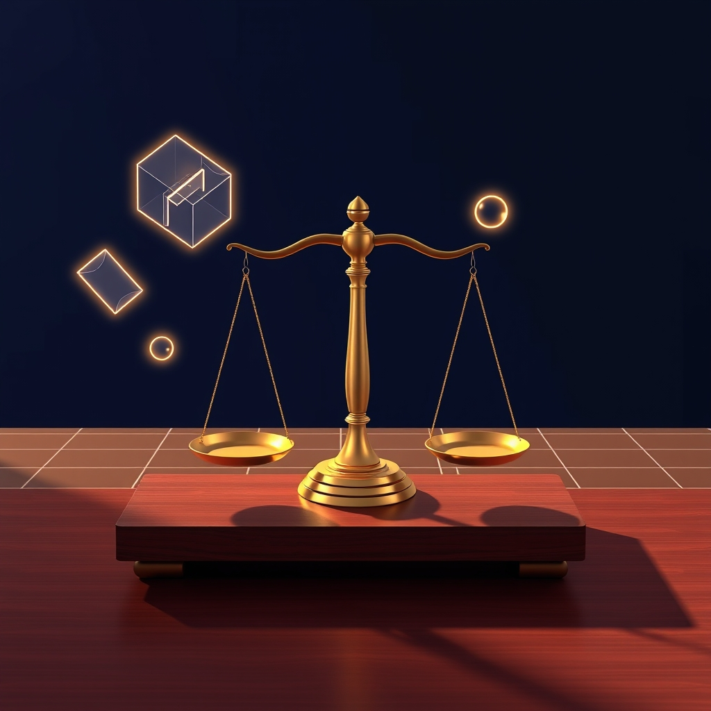

[Home](../index.md) > [Reflections](./index.md) | [⏮️](./2025-05-27.md) [⏭️](./2025-05-29.md)  
# 2025-05-28 | ⚖️ Lawgic 💭  
  
  
## 📚 Books  
- [🤔⚖️ Thinking Like a Lawyer: A New Introduction to Legal Reasoning](../books/thinking-like-a-lawyer-a-new-introduction-to-legal-reasoning.md)  
- [👩🏼‍⚖️💭🧮🏆 The Tools of Argument: How the Best Lawyers Think, Argue, and Win](../books/the-tools-of-argument-how-the-best-lawyers-think-argue-and-win.md)  
- [👩🏼‍⚖️⚖️💭🧮🗣️ Handbook of Legal Reasoning and Argumentation](../books/handbook-of-legal-reasoning-and-argumentation.md)  
  
## 🦋 Bluesky    
<blockquote class="bluesky-embed" data-bluesky-uri="at://did:plc:i4yli6h7x2uoj7acxunww2fc/app.bsky.feed.post/3mrti4te3uh23" data-bluesky-cid="bafyreihkavneb6julxdjbw7tpiqawddsja3wmw6zam52lyz6r2yrg3p3kq">
2025-05-28 | ⚖️ Lawgic 💭  
  
#AI Q: ⚖️ Does legal reasoning belong in everyday conversation?  
  
⚖️ Legal Reasoning | 🗣️ Argumentation | 🧠 Critical Thinking  
https://bagrounds.org/reflections/2025-05-28
&mdash; <a href="https://bsky.app/profile/did:plc:i4yli6h7x2uoj7acxunww2fc?ref_src=embed">Bryan Grounds (@bagrounds.bsky.social)</a> <a href="https://bsky.app/profile/did:plc:i4yli6h7x2uoj7acxunww2fc/post/3mrti4te3uh23?ref_src=embed">2026-07-30T03:18:10.000Z</a></blockquote>