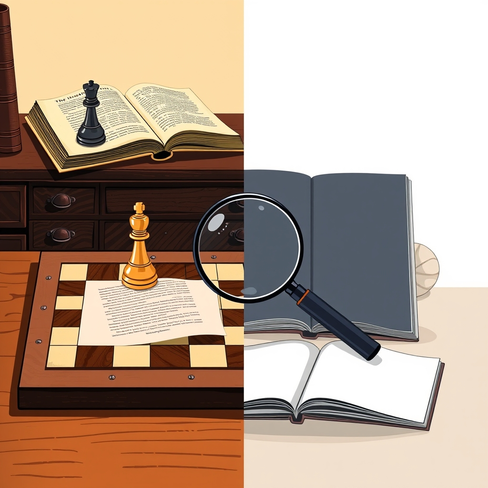

[Home](../index.md) > [Reflections](./index.md) | [⏮️](./2025-06-04.md) [⏭️](./2025-06-06.md)  
# 2025-06-05 | ♟️ Strategy | 🦜 Language | 🔬 Focus 📚📺  
  
## 📚 Books  
### ♟️ Strategy  
- [🇺🇸🪖♟️🔍⚖️🕊️🤝 How Ike Led: The Principles Behind Eisenhower's Biggest Decisions](../books/how-ike-led-the-principles-behind-eisenhowers-biggest-decisions.md)  
- [🎨⚔️ The Art of War](../books/the-art-of-war.md)  
  
### 🦜 Language Development  
- [👶🦓🌊 Hello, Ocean Friends: A Black-and-White Board Book for Babies That Helps Visual Development](../books/hello-ocean-friends-a-black-and-white-board-book-for-babies-that-helps-visual-development.md)  
- [👶🔤 The ABC’s of Language Development: Discover Language with Your Child](../books/the-abcs-of-language-development-discover-language-with-your-child.md)  
- [👶🗣️ My First Learn-to-Talk Book: Created by an Early Speech Expert!](../books/my-first-learn-to-talk-book-created-by-an-early-speech-expert.md)  
- [🗣️👶 Talk to Me, Baby!: How You Can Support Young Children's Language Development](../books/talk-to-me-baby-how-you-can-support-young-childrens-language-development.md)  
- [🗣️👶📚 Language, Literacy and Communication in the Early Years: A critical foundation](../books/language-literacy-and-communication-in-the-early-years-a-critical-foundation.md)  
  
## 📺 Videos  
- [👶🗣️🔤📢 📖 The ABCs of Language Development: Discover Language With Your Child](../videos/the-abcs-of-language-development-discover-language-with-your-child.md)  
- [🧠⏳🚀⚡ 4 ADHD Habits to Make 2025 Hyper Productive](../videos/4-adhd-habits-to-make-2025-hyper-productive.md)  
- [2️⃣⬆️🧠👩‍🚀 Double Your Productivity using this ADHD System (Invented by a Space Systems Engineer)](../videos/double-your-productivity-using-this-adhd-system-invented-by-a-space-systems-engineer.md)  
  
## 🐦 Tweet  
<blockquote class="twitter-tweet" data-theme="dark">
2025-06-05 | ♟️ Strategy | 🦜 Language | 🔬 Focus 📚📺  🇺🇸 Eisenhower | 🎨 Art of War | 👶 Baby Books | 🧠 ADHD | 🚀 Productivity<a href="https://t.co/0SrgiJstQm">https://t.co/0SrgiJstQm</a>
&mdash; Bryan Grounds (@bagrounds) <a href="https://twitter.com/bagrounds/status/1930798212270715103?ref_src=twsrc%5Etfw">June 6, 2025</a></blockquote> 