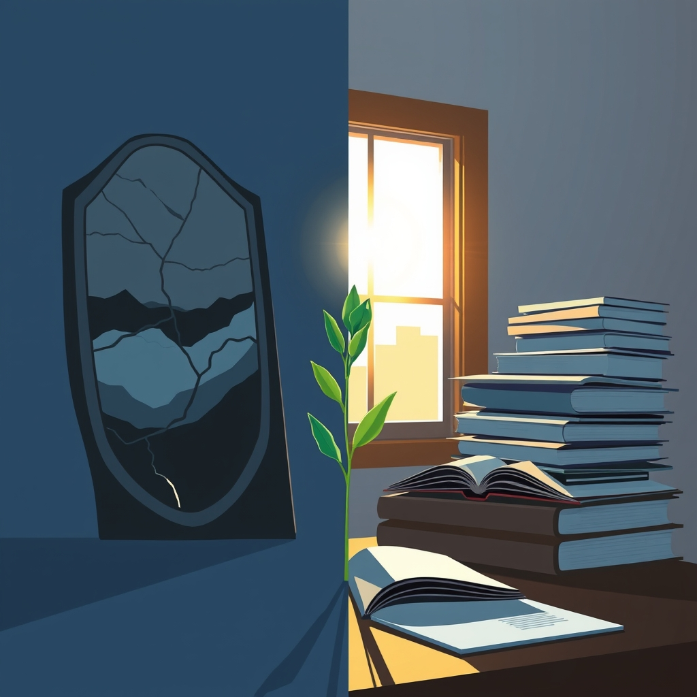

[Home](../index.md) > [Reflections](./index.md) | [⏮️](./2025-06-08.md) [⏭️](./2025-06-10.md)  
# 2025-06-09 | 🤥 Lying | 🌄 Morning 📚📺  
  
  
## 📚 Books  
- [🇺🇸🇩🇪🤥📣 Trump and Hitler: A Comparative Study in Lying](../books/trump-and-hitler-a-comparative-study-in-lying.md)  
  
## 📺 Videos  
- [🌅🧠🗝️🚀📈 The Remarkable Morning Method: 5 Ways to Unlock Your Best Mental State](../videos/the-remarkable-morning-method-5-ways-to-unlock-your-best-mental-state.md)