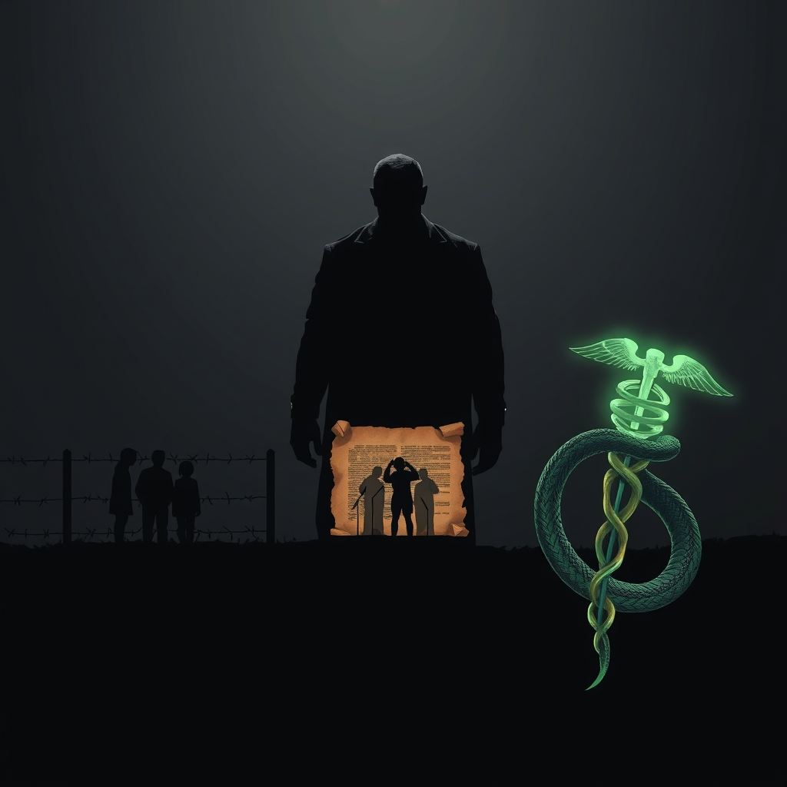

[Home](../index.md) > [Reflections](./index.md) | [⏮️](./2025-06-09.md) [⏭️](./2025-06-11.md)  
# 2025-06-10 | 🥸⚔️👨‍👩‍👧‍👦 ICE vs Family | 👹⚔️🪧 Trump vs Speech | 🐍⚔️⚕️ RFK vs Health  
  
  
## 📚 Books  
- ⏯️ Continuing [🗓️➕ 40 Days to Positive Change: Daily Support to Create a New Habit](../books/40-days-to-positive-change-daily-support-to-create-a-new-habit.md)  
- [🍊🤡🤥👹💥🏛️🇺🇸 I Alone Can Fix It: Donald J. Trump's Catastrophic Final Year](../books/i-alone-can-fix-it-donald-j-trumps-catastrophic-final-year.md)  
- [🤡🫨😭🤬😵‍💫🤥👹🇺🇸 A Very Stable Genius: Donald J. Trump's Testing of America](../books/a-very-stable-genius-donald-j-trumps-testing-of-america.md)  
  
## 📰 News  
- [👨‍⚖️💂‍♂️🚨🇺🇸 Trump Orders Another 2,000 Guardsmen, 700 Marines To LA | NPR News Now](../videos/trump-orders-another-2000-guardsmen-700-marines-to-la-npr-news-now.md)  
- [👹🪖🇺🇸🚧✊🏾 Troops deployed in LA as immigration raids stir fear and protests](../videos/troops-deployed-in-la-as-immigration-raids-stir-fear-and-protests.md)  
- [👴🏻🪖🇺🇸🤥👹❓ Retired military leaders analyze Trump's deployment of Marines and National Guard in LAW](../videos/retired-military-leaders-analyze-trumps-deployment-of-marines-and-national-guard-in-la.md)  
- [👨‍⚕️➡️😬💉💥 Former CDC director reacts to RFK Jr.'s firing of entire vaccine advisory panel](../videos/former-cdc-director-reacts-to-rfk-jrs-firing-of-entire-vaccine-advisory-panel.md)  
  
## 🃏 Satire  
- [🇺🇸😡📺 Jon Stewart on the L.A. ICE Protests and Trump's Escalating Response | The Daily Show](../videos/jon-stewart-on-the-la-ice-protests-and-trumps-escalating-response-the-daily-show.md)