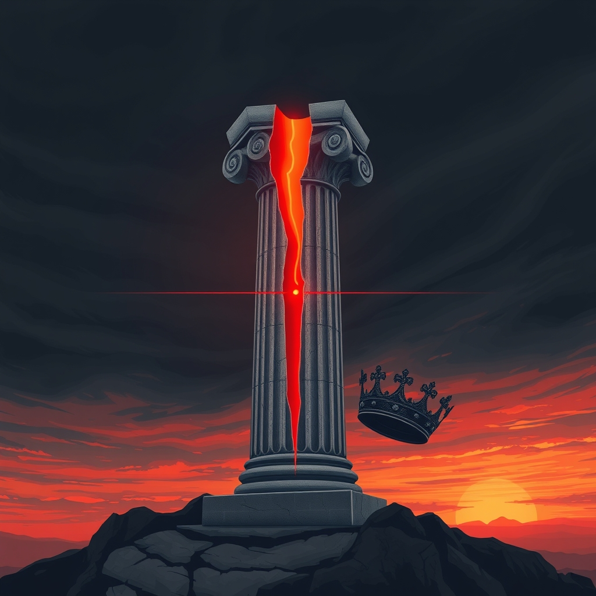

[Home](../index.md) > [Reflections](./index.md) | [⏮️](./2025-06-13.md) [⏭️](./2025-06-15.md)  
# 2025-06-14 | 🎯🏛️ Assassination | 🇮🇱🚀🇮🇷 War | 🚫👑 No Kings  
  
  
## 📰 News  
- [⚔️💥🏛️🇮🇱🇮🇷🪧🇺🇸🎂 PBS News Weekend full episode, June 14, 2025](../videos/pbs-news-weekend-full-episode-june-14-2025.md)  
  
## 📚 Books  
- [🇺🇸💥 Political Violence in America: Historical Flashpoints and Modern-Day Trends](../books/political-violence-in-america-historical-flashpoints-and-modern-day-trends.md)  
- [🇺🇸⚠️ Harbingers: What January 6 and Charlottesville Reveal About Rising Threats to American Democracy](../books/harbingers-what-january-6-and-charlottesville-reveal-about-rising-threats-to-american-democracy.md)  
  
## 🦋 Bluesky    
<blockquote class="bluesky-embed" data-bluesky-uri="at://did:plc:i4yli6h7x2uoj7acxunww2fc/app.bsky.feed.post/3mmn52tosup26" data-bluesky-cid="bafyreidzkmuclc5h5alfiddqcbddlqifti5cx5tt5zjajdfeqb6dh4zema">
2025-06-14 | 🎯🏛️ Assassination | 🇮🇱🚀🇮🇷 War | 🚫👑 No Kings  
  
#AI Q: ⚖️ Can democracy survive the rise of political violence?  
  
🇺🇸 American Democracy | 📉 Political Violence | 📺 Current Events | 🏛️ Civil Unrest  
https://bagrounds.org/reflections/2025-06-14
&mdash; <a href="https://bsky.app/profile/did:plc:i4yli6h7x2uoj7acxunww2fc?ref_src=embed">Bryan Grounds (@bagrounds.bsky.social)</a> <a href="https://bsky.app/profile/did:plc:i4yli6h7x2uoj7acxunww2fc/post/3mmn52tosup26?ref_src=embed">2026-05-24T23:38:16.000Z</a></blockquote>