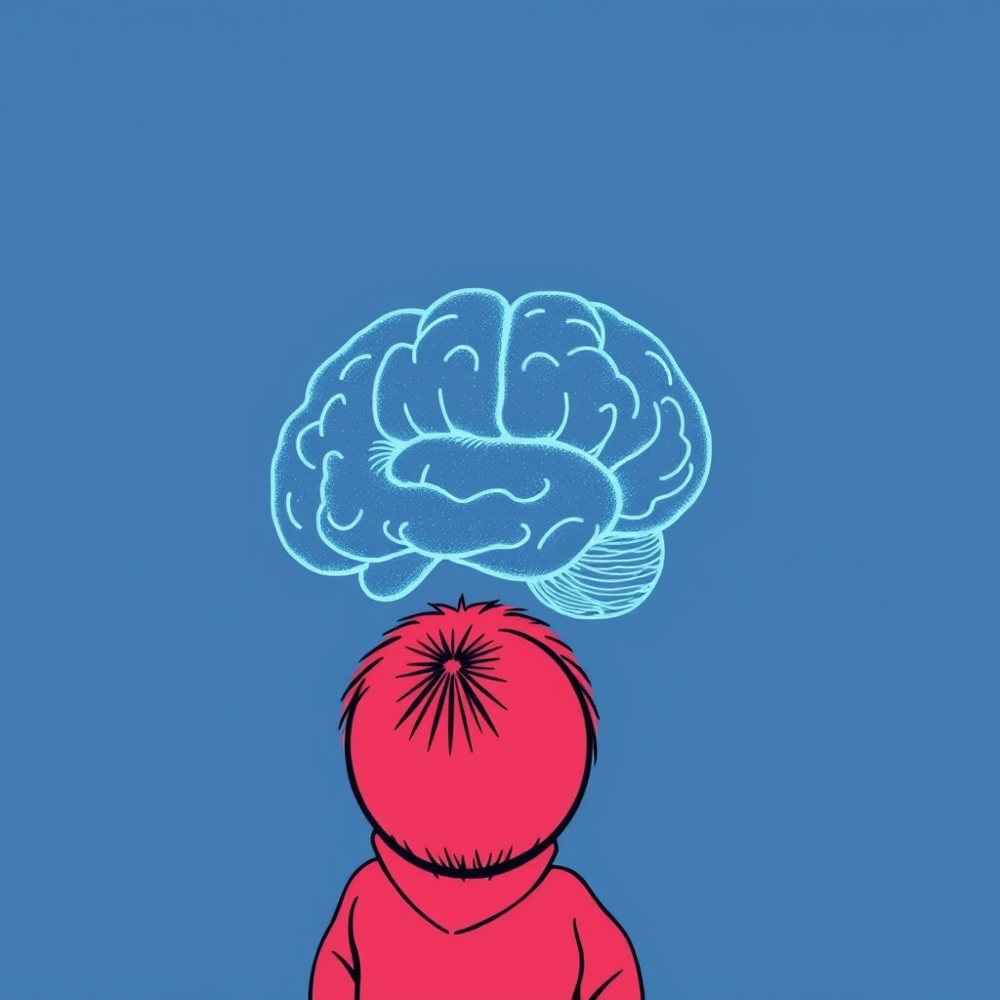

[Home](../index.md) > [Reflections](./index.md) | [⏮️](./2025-06-17.md) [⏭️](./2025-06-19.md)  
# 2025-06-18 | 👶🏼 Baby 🔬 Science 📺📚  
  
## 📺 Videos  
- [💥🧠👶 The «Big Bang» in Learning: Brain Changes and Childhood Learning (Full Session)](../videos/the-big-bang-in-learning-brain-changes-and-childhood-learning-full-session.md)  
  
## 📚 Books  
- ▶️ Starting [🧪👶📈 Scientific Secrets for Raising Kids Who Thrive](../books/scientific-secrets-for-raising-kids-who-thrive.md)  
- [👨‍👩‍👧‍👦🧠 Second Nature: How Parents Can Use Neuroscience to Help Kids Develop Empathy, Creativity, and Self-Control](../books/second-nature-how-parents-can-use-neuroscience-to-help-kids-develop-empathy-creativity-and-self-control.md)  
- [👶🧠🔬 The Scientist in the Crib: Minds, Brains, And How Children Learn](../books/the-scientist-in-the-crib-minds-brains-and-how-children-learn.md)  
- [👶🤔❤️ The Philosophical Baby: What Children's Minds Tell Us About Truth, Love, and the Meaning of Life](../books/the-philosophical-baby-what-childrens-minds-tell-us-about-truth-love-and-the-meaning-of-life.md)  
  
## 🐦 Tweet  
<blockquote class="twitter-tweet" data-theme="dark">
2025-06-18 | 👶🏼 Baby 🔬 Science 📺📚  📺 Videos | 📚 Books | 📈 Child Development | 🧠 Neuroscience | 🤔 Philosophy<a href="https://t.co/C3ZbnGfpwa">https://t.co/C3ZbnGfpwa</a>
&mdash; Bryan Grounds (@bagrounds) <a href="https://twitter.com/bagrounds/status/1935580937364119557?ref_src=twsrc%5Etfw">June 19, 2025</a></blockquote> 