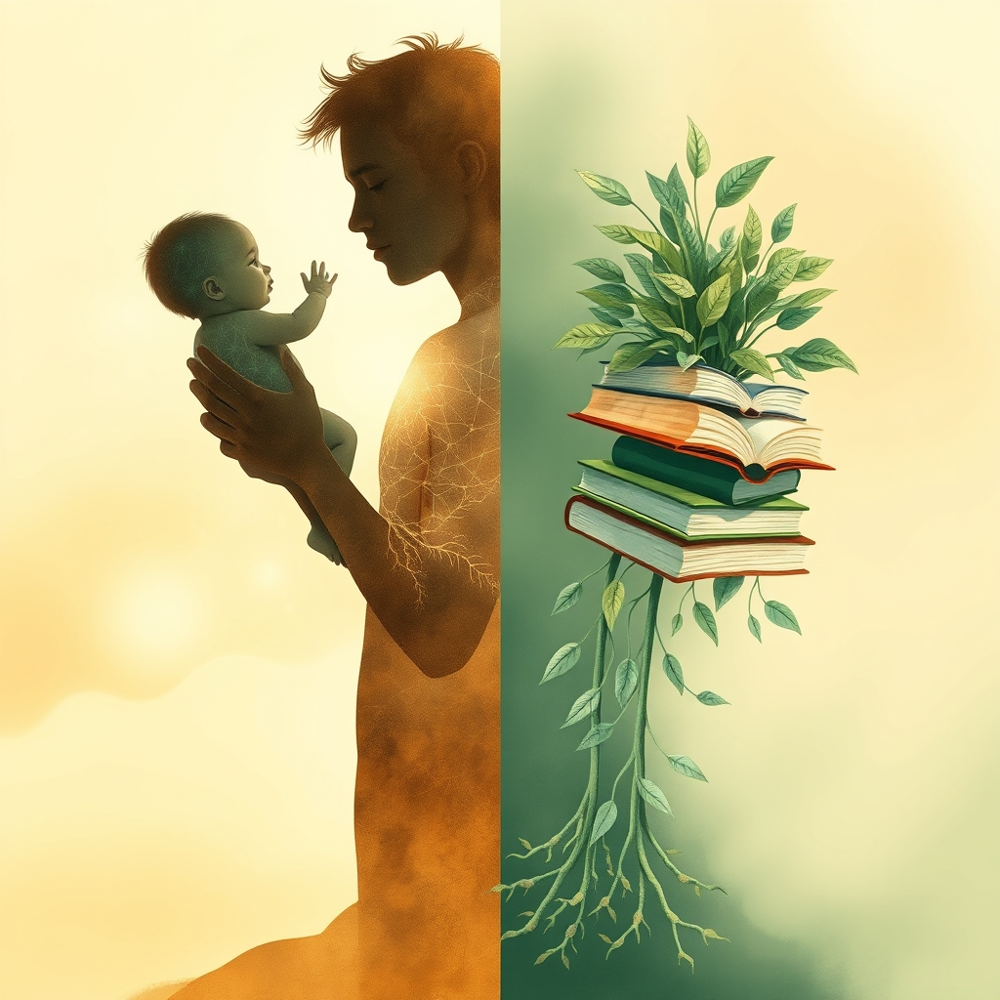

[Home](../index.md) > [Reflections](./index.md) | [⏮️](./2025-06-18.md) [⏭️](./2025-06-20.md)  
# 2025-06-19 | 🤱🏼🪞 Inside Out 📚  
  
  
## 📚 Books  
- [🤱🏼🤿🪞🌱 Parenting from the Inside Out: How a Deeper Self-Understanding Can Help You Raise Children Who Thrive](../books/parenting-from-the-inside-out-how-a-deeper-self-understanding-can-help-you-raise-children-who-thrive.md)  
  
## 🦋 Bluesky    
<blockquote class="bluesky-embed" data-bluesky-uri="at://did:plc:i4yli6h7x2uoj7acxunww2fc/app.bsky.feed.post/3mmjlehwnpc2e" data-bluesky-cid="bafyreihtehubnghlys3c6hwkp64xznogwkd3bo4zjsgspgnn3ufvp5dmqu">
2025-06-19 | 🤱🏼🪞 Inside Out 📚  
  
#AI Q: 🧠 Does understanding your own past change how you parent today?  
  
👶 Child Development | 🧠 Psychology | 🧘 Self-Awareness  
https://bagrounds.org/reflections/2025-06-19
&mdash; <a href="https://bsky.app/profile/did:plc:i4yli6h7x2uoj7acxunww2fc?ref_src=embed">Bryan Grounds (@bagrounds.bsky.social)</a> <a href="https://bsky.app/profile/did:plc:i4yli6h7x2uoj7acxunww2fc/post/3mmjlehwnpc2e?ref_src=embed">2026-05-23T13:43:32.000Z</a></blockquote>