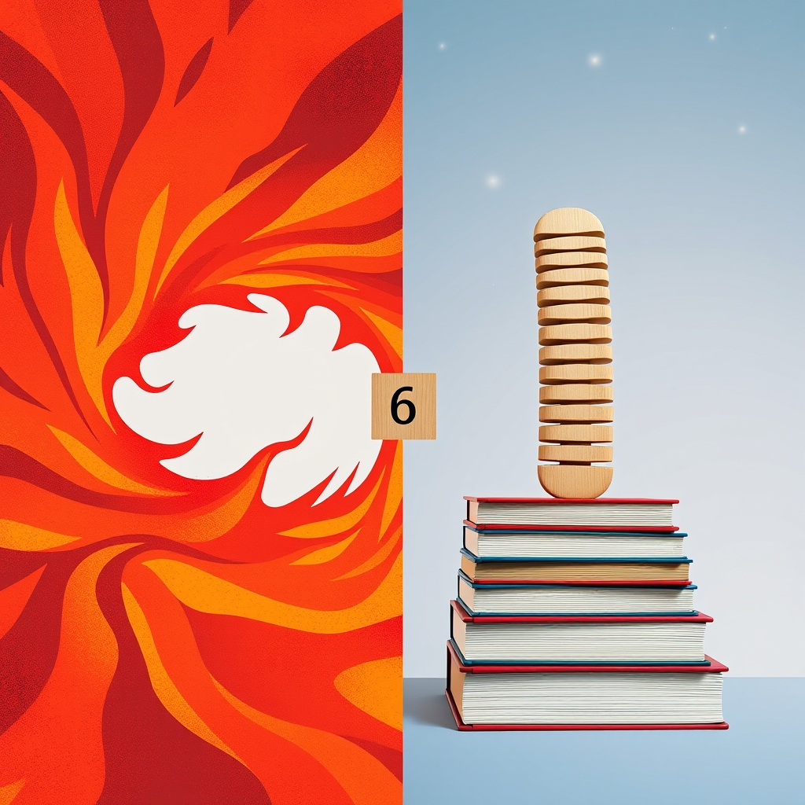

[Home](../index.md) > [Reflections](./index.md) | [⏮️](./2025-06-25.md) [⏭️](./2025-06-27.md)  
# 2025-06-26 | 🔥🇺🇸 Fire | 🔙 Back | 👶🏼🔢 Baby 📚🌌  
  
  
## 📚 Books  
- [🔥💣💥😡🤬 Fire and Fury: Inside the Trump White House](../books/fire-and-fury-inside-the-trump-white-house.md)  
- [🛡️🌪️🇷🇺🔥 Siege: Trump Under Fire](../books/siege-trump-under-fire.md)  
- [🍬🫵🔙 Treat Your Own Back](../books/treat-your-own-back.md)  
- [🔙🛠️ Back Mechanic](../books/back-mechanic.md)  
- ⏯️ Continuing [🧪👶📈 Scientific Secrets for Raising Kids Who Thrive](../books/scientific-secrets-for-raising-kids-who-thrive.md)  
  
## 🌌 Topics  
- [🔢💯 Hundred Board](../topics/hundred-board.md)