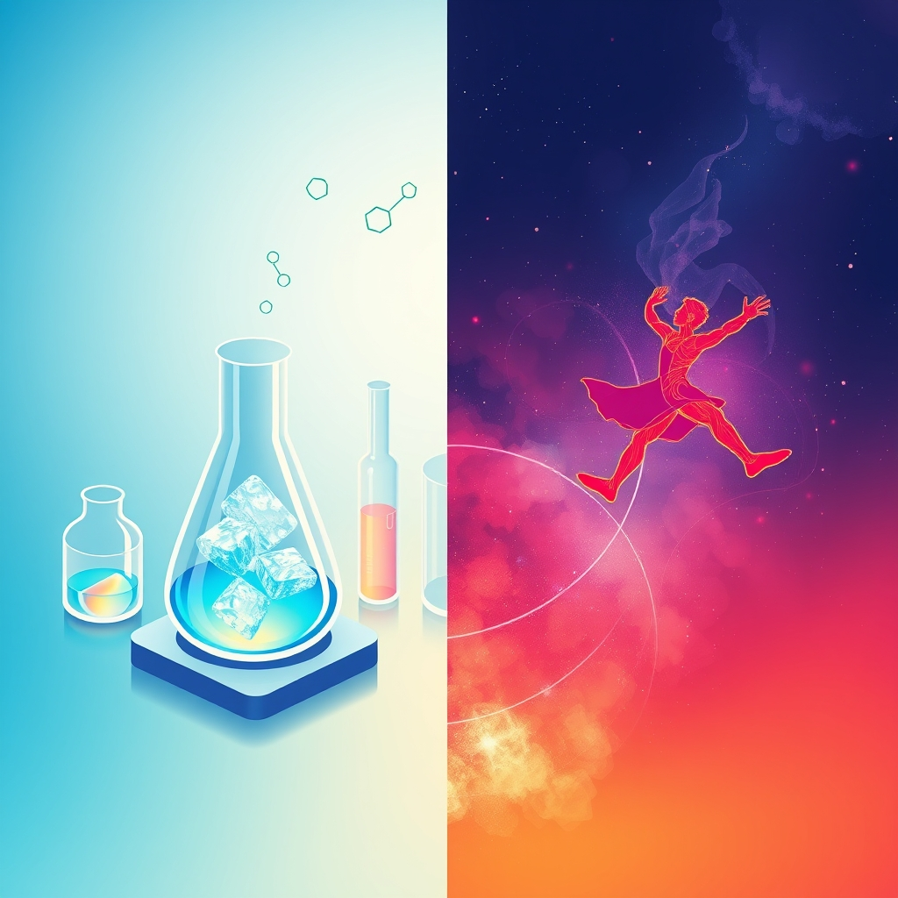

[Home](../index.md) > [Reflections](./index.md) | [⏮️](./2025-06-28.md) [⏭️](./2025-06-30.md)  
# 2025-06-29 | 💪 Creatine | 💃🏼🕺🏽 Movement 🌌📚📺  
  
## 🌌 Topics  
- [💪🏋️‍♂️ Creatine](../topics/creatine.md)  
  
## 📚 Books  
- [💪⚕️ Essentials of Creatine in Sports and Health](../books/essentials-of-creatine-in-sports-and-health.md)  
- [💪📈 Creatine: A Natural Substance and Its Benefits for Muscle Metabolism, Fitness, Health & Longevity](../books/creatine-a-natural-substance-and-its-benefits-for-muscle-metabolism-fitness-health-longevity.md)  
- ▶️ Starting [🏃😊❤️ The Joy of Movement: How Exercise Helps Us Find Happiness, Hope, Connection, and Courage](../books/the-joy-of-movement-how-exercise-helps-us-find-happiness-hope-connection-and-courage.md)  
- [🧠🏃 The Psychological Benefits of Exercise and Physical Activity](../books/the-psychological-benefits-of-exercise-and-physical-activity.md)  
  
## 📺 Videos  
- [❓💪🔬 12 Questions About Creatine with Stephen Cornish, PhD](../videos/12-questions-about-creatine-w-stephen-cornish-phd.md)  
  
## 📄 Articles  
- [💪🧠📉💊🔎 Creatine Supplementation in Depression: A Review of Mechanisms, Efficacy, Clinical Outcomes, and Future Directions](../articles/creatine-supplementation-in-depression-a-review-of-mechanisms-efficacy-clinical-outcomes-and-future-directions.md)  
  
## 🦋 Bluesky    
<blockquote class="bluesky-embed" data-bluesky-uri="at://did:plc:i4yli6h7x2uoj7acxunww2fc/app.bsky.feed.post/3motwtfnqpp2y" data-bluesky-cid="bafyreieyv7gv3b3hgrjswofmqfc5i3srlu7sejetnwxrta2pefqkreakvu">
2025-06-29 | 💪 Creatine | 💃🏼🕺🏽 Movement 🌌📚📺  
  
#AI Q: 💪 Does physical movement or supplementation play a bigger role in your mental health?  
  
🏋️ Sports Nutrition | 🧠 Mental Wellness | ⏳ Longevity | 🔬  
https://bagrounds.org/reflections/2025-06-29
&mdash; <a href="https://bsky.app/profile/did:plc:i4yli6h7x2uoj7acxunww2fc?ref_src=embed">Bryan Grounds (@bagrounds.bsky.social)</a> <a href="https://bsky.app/profile/did:plc:i4yli6h7x2uoj7acxunww2fc/post/3motwtfnqpp2y?ref_src=embed">2026-06-22T03:25:45.000Z</a></blockquote>