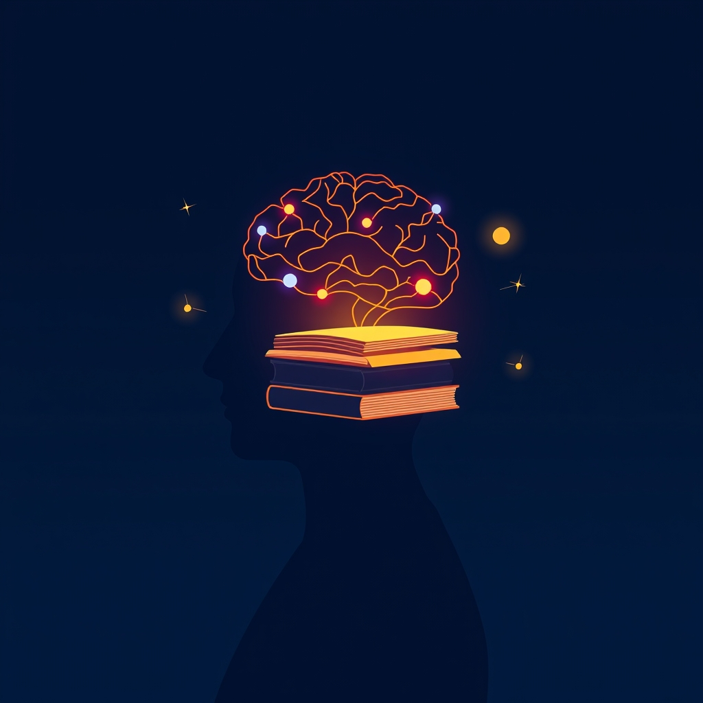

[Home](../index.md) > [Reflections](./index.md) | [⏮️](./2025-07-01.md) [⏭️](./2025-07-03.md)  
# 2025-07-02 | 🧠 Brains 📚  
  
  
## 📚 Books  
- ⏯️ Continuing [🧠📈 Outsmart Yourself: Brain-Based Strategies for a Bettery You](../books/outsmart-yourself-brain-based-strategies-for-a-bettery-you.md)  
- [🧠💡📈🏠🏢🧑‍🎓 Brain Rules: 12 Principles for Surviving and Thriving at Work, Home, and School](../books/brain-rules-12-principles-for-surviving-and-thriving-at-work-home-and-school.md)