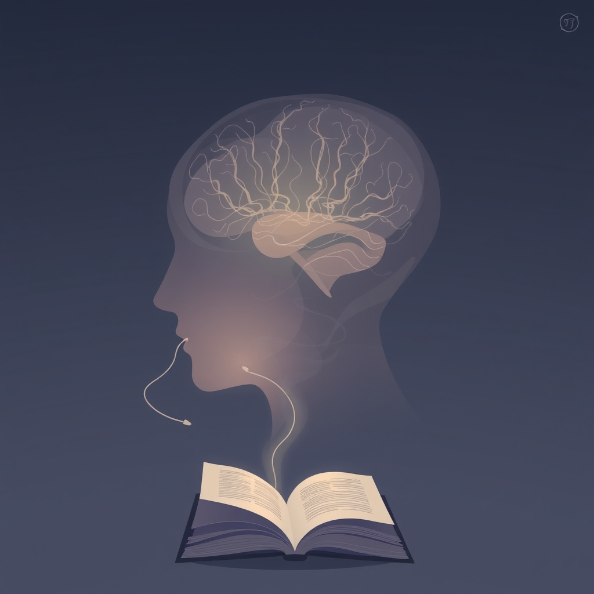

[Home](../index.md) > [Reflections](./index.md) | [⏮️](./2025-07-02.md) [⏭️](./2025-07-04.md)  
# 2025-07-03 | 🤫 Subliminal 📚  
  
  
## 📚 Books  
- [🤫🧠 Subliminal: How Your Unconscious Mind Rules Your Behavior](../books/subliminal-how-your-unconscious-mind-rules-your-behavior.md)