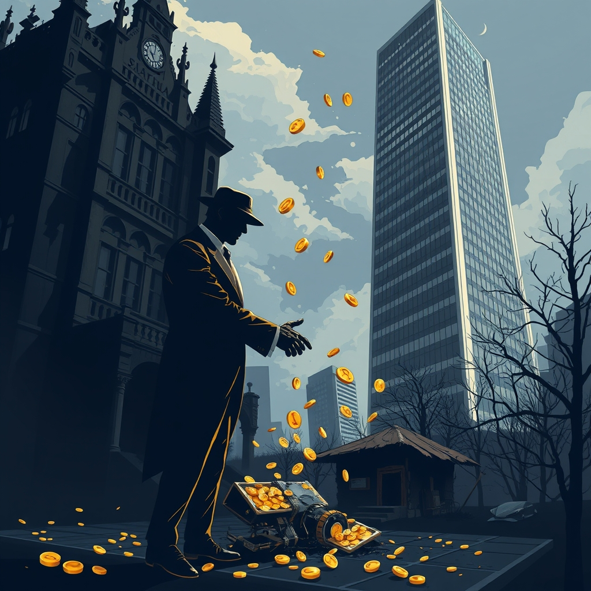

[Home](../index.md) > [Reflections](./index.md) | [⏮️](./2025-07-04.md) [⏭️](./2025-07-06.md)  
# 2025-07-05 | 🤕🏚️➡️💸➡️🏰 Robber 🧛🏻‍♂️🤝👹 Barons 🤖💬📚📺📄  
  
## 🤖💬 Bot Chats  
- [🤕😖 Headaches](../bot-chats/headaches.md)  
  
## 📚 Books  
- [🤕⚕️ The Headache Handbook: Diagnosis and Treatment](../books/the-headache-handbook-diagnosis-and-treatment.md)  
- ⏯️ Continuing [🧠📈 Outsmart Yourself: Brain-Based Strategies for a Bettery You](../books/outsmart-yourself-brain-based-strategies-for-a-bettery-you.md)  
  
## 📺 Video  
- [🇺🇸📈💡🔮🚀 What the U.S. has accomplished in 250 years of innovation and what’s next](../videos/what-the-us-has-accomplished-in-250-years-of-innovation-and-whats-next.md)  
- [😵‍💫🇺🇸🐘🚫 Strange cognitive dissonance among the MAGA who are convinced to vote against their own interests](../videos/strange-cognitive-dissonance-among-the-maga-who-are-convinced-to-vote-against-their-own-interests.md)  
- [💰🔄 Trump’s mega bill ‘hasn’t even cut taxes, it’s redistributed them’ | Justin Wolfers](../videos/trumps-mega-bill-hasnt-even-cut-taxes-its-redistributed-them-justin-wolfers.md)  
- [📊📈📉📃👁️ 10 Charts to Understand the 900 Page Budget Bill](../videos/10-charts-to-understand-the-900-page-budget-bill.md)  
  
## 📄 Articles  
- [💻💰🤝👹🇺🇸 Tech moguls Altman, Bezos and Zuckerberg donate to Trump's inauguration fund](../articles/tech-moguls-altman-bezos-and-zuckerberg-donate-to-trumps-inauguration-fund.md)  
  
## 🐦 Tweet  
<blockquote class="twitter-tweet" data-theme="dark">
2025-07-05 | 🤕🏚️➡️💸➡️🏰 Robber 🧛🏻‍♂️🤝👹 Barons 🤖💬📚📺📄  🧛🏻‍♂️💸 Billionaires fund 🐘 Republicans who steal from the 🏚️ poor to fund hand outs for the 🏰 rich.<a href="https://t.co/dAVbHm7sBu">https://t.co/dAVbHm7sBu</a>
&mdash; Bryan Grounds (@bagrounds) <a href="https://twitter.com/bagrounds/status/1941738294339072391?ref_src=twsrc%5Etfw">July 6, 2025</a></blockquote>   
  
## 🦋 Bluesky    
<blockquote class="bluesky-embed" data-bluesky-uri="at://did:plc:i4yli6h7x2uoj7acxunww2fc/app.bsky.feed.post/3mrtd5oljwk25" data-bluesky-cid="bafyreicxjyiqatbfwoopfke65jtz3ftohbwj6vmrhvzj456xygrv6m646a">
2025-07-05 | 🤕🏚️➡️💸➡️🏰 Robber 🧛🏻‍♂️🤝👹 Barons 🤖💬📚📺📄  
  
#AI Q: 💰 Should tech moguls influence political agendas?  
  
🧠 Brain Science | 📈 Economic Policy | 💻 Tech Moguls | 🇺🇸  
https://bagrounds.org/reflections/2025-07-05
&mdash; <a href="https://bsky.app/profile/did:plc:i4yli6h7x2uoj7acxunww2fc?ref_src=embed">Bryan Grounds (@bagrounds.bsky.social)</a> <a href="https://bsky.app/profile/did:plc:i4yli6h7x2uoj7acxunww2fc/post/3mrtd5oljwk25?ref_src=embed">2026-07-30T01:49:10.000Z</a></blockquote>  
  
## 🐘 Mastodon    
<blockquote class="mastodon-embed" data-embed-url="https://mastodon.social/@bagrounds/117018577338147507/embed" style="background: #282c37; border-radius: 8px; border: 1px solid #393f4f; margin: 0; max-width: 540px; min-width: 270px; overflow: hidden; padding: 0;"> <a href="https://mastodon.social/@bagrounds/117018577338147507" target="_blank" style="align-items: center; color: #d9e1e8; display: flex; flex-direction: column; font-family: system-ui, -apple-system, BlinkMacSystemFont, 'Segoe UI', Oxygen, Ubuntu, Cantarell, 'Fira Sans', 'Droid Sans', 'Helvetica Neue', Roboto, sans-serif; font-size: 14px; justify-content: center; letter-spacing: 0.25px; line-height: 20px; padding: 24px; text-decoration: none;"> <svg xmlns="http://www.w3.org/2000/svg" xmlns:xlink="http://www.w3.org/1999/xlink" width="32" height="32" viewBox="0 0 79 75"><path d="M63 45.3v-20c0-4.1-1-7.3-3.2-9.7-2.1-2.4-5-3.7-8.5-3.7-4.1 0-7.2 1.6-9.3 4.7l-2 3.3-2-3.3c-2-3.1-5.1-4.7-9.2-4.7-3.5 0-6.4 1.3-8.6 3.7-2.1 2.4-3.1 5.6-3.1 9.7v20h8V25.9c0-4.1 1.7-6.2 5.2-6.2 3.8 0 5.8 2.5 5.8 7.4V37.7H44V27.1c0-4.9 1.9-7.4 5.8-7.4 3.5 0 5.2 2.1 5.2 6.2V45.3h8ZM74.7 16.6c.6 6 .1 15.7.1 17.3 0 .5-.1 4.8-.1 5.3-.7 11.5-8 16-15.6 17.5-.1 0-.2 0-.3 0-4.9 1-10 1.2-14.9 1.4-1.2 0-2.4 0-3.6 0-4.8 0-9.7-.6-14.4-1.7-.1 0-.1 0-.1 0s-.1 0-.1 0 0 .1 0 .1 0 0 0 0c.1 1.6.4 3.1 1 4.5.6 1.7 2.9 5.7 11.4 5.7 5 0 9.9-.6 14.8-1.7 0 0 0 0 0 0 .1 0 .1 0 .1 0 0 .1 0 .1 0 .1.1 0 .1 0 .1.1v5.6s0 .1-.1.1c0 0 0 0 0 .1-1.6 1.1-3.7 1.7-5.6 2.3-.8.3-1.6.5-2.4.7-7.5 1.7-15.4 1.3-22.7-1.2-6.8-2.4-13.8-8.2-15.5-15.2-.9-3.8-1.6-7.6-1.9-11.5-.6-5.8-.6-11.7-.8-17.5C3.9 24.5 4 20 4.9 16 6.7 7.9 14.1 2.2 22.3 1c1.4-.2 4.1-1 16.5-1h.1C51.4 0 56.7.8 58.1 1c8.4 1.2 15.5 7.5 16.6 15.6Z" fill="currentColor"/></svg> 
Post by @bagrounds@mastodon.social
 
View on Mastodon
 </a> </blockquote> 