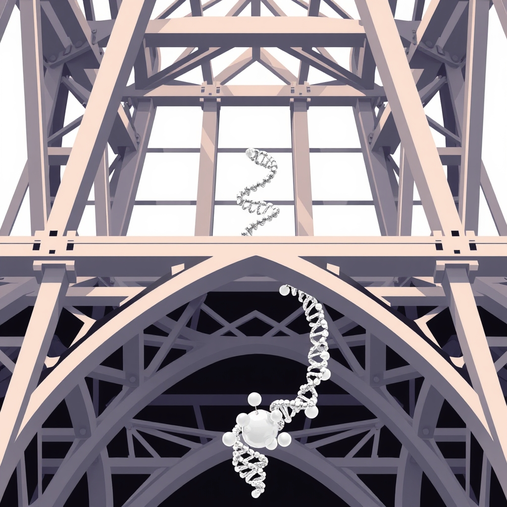

[Home](../index.md) > [Reflections](./index.md) | [⏮️](./2025-07-06.md) [⏭️](./2025-07-08.md)  
# 2025-07-07 | 🇺🇸🔬🏗️ Structure 📺📚  
  
  
## 📺 Videos  
- [🇺🇸🛠️⏱️🏛️ How to Rebuild American Democracy in 20 Minutes](../videos/how-to-rebuild-american-democracy-in-20-minutes.md)  
  
## 📚 Books  
- [🏛️🗣️ Polemic for Democracy](../books/polemic-for-democracy.md)  
- [🔬🔄 The Structure of Scientific Revolutions](../books/the-structure-of-scientific-revolutions.md)