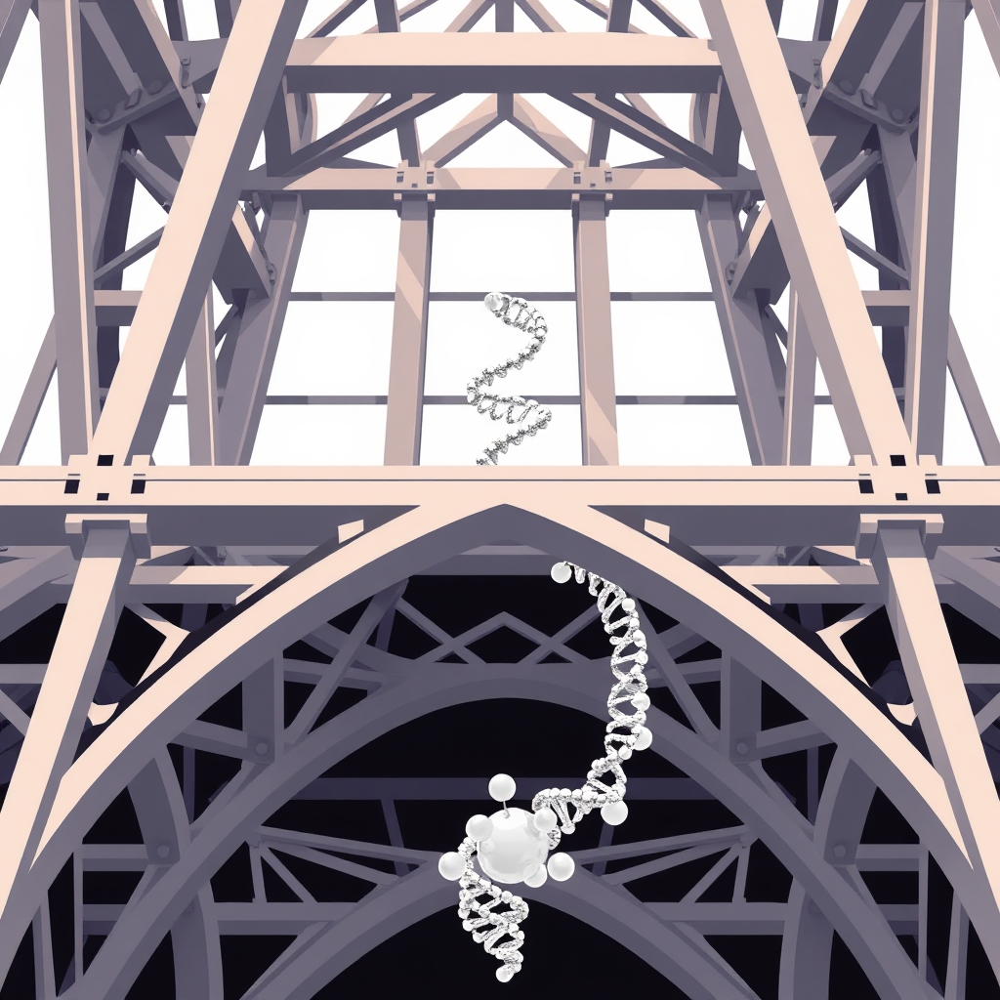

[Home](../index.md) > [Reflections](./index.md) | [⏮️](./2025-07-06.md) [⏭️](./2025-07-08.md)  
# 2025-07-07 | 🇺🇸🔬🏗️ Structure 📺📚  
  
  
## 📺 Videos  
- [🇺🇸🛠️⏱️🏛️ How to Rebuild American Democracy in 20 Minutes](../videos/how-to-rebuild-american-democracy-in-20-minutes.md)  
  
## 📚 Books  
- [🏛️🗣️ Polemic for Democracy](../books/polemic-for-democracy.md)  
- [🔬🔄 The Structure of Scientific Revolutions](../books/the-structure-of-scientific-revolutions.md)  
  
## 🦋 Bluesky    
<blockquote class="bluesky-embed" data-bluesky-uri="at://did:plc:i4yli6h7x2uoj7acxunww2fc/app.bsky.feed.post/3mspstjju4v2q" data-bluesky-cid="bafyreie2hdf5r6twso5apmuubibxz4vw3obkpawn5dam64up4tsxrhslgi">
2025-07-07 | 🇺🇸🔬🏗️ Structure 📺📚  
  
#AI Q: 🏛️ Can societal structures evolve faster than scientific paradigms?  
  
🏛️ Civic Reform | 🔬 Philosophy of Science | 🗳️ Political Theory  
https://bagrounds.org/reflections/2025-07-07
&mdash; <a href="https://bsky.app/profile/did:plc:i4yli6h7x2uoj7acxunww2fc?ref_src=embed">Bryan Grounds (@bagrounds.bsky.social)</a> <a href="https://bsky.app/profile/did:plc:i4yli6h7x2uoj7acxunww2fc/post/3mspstjju4v2q?ref_src=embed">2026-08-10T09:44:22.000Z</a></blockquote>