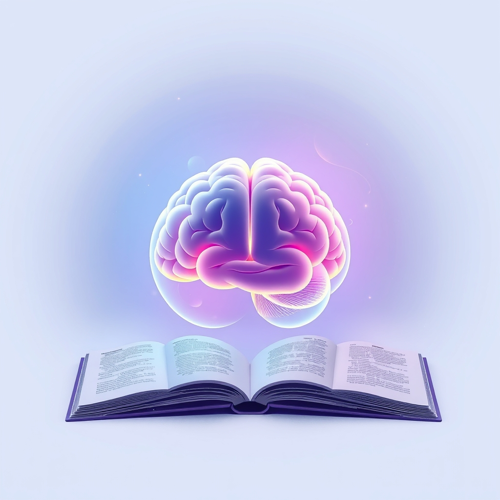

[Home](../index.md) > [Reflections](./index.md) | [⏮️](./2025-07-07.md) [⏭️](./2025-07-09.md)  
# 2025-07-08 | 🧠🧘🏼‍♀️ Operating Ourselves 📚  
  
  
## 📚 Books  
- 🏁 Finished [🧠📈 Outsmart Yourself: Brain-Based Strategies for a Bettery You](../books/outsmart-yourself-brain-based-strategies-for-a-bettery-you.md)  
- ▶️ Started [Practicing Mindfulness: An Introduction to Meditation](../books/practicing-mindfulness-an-introduction-to-meditation.md)