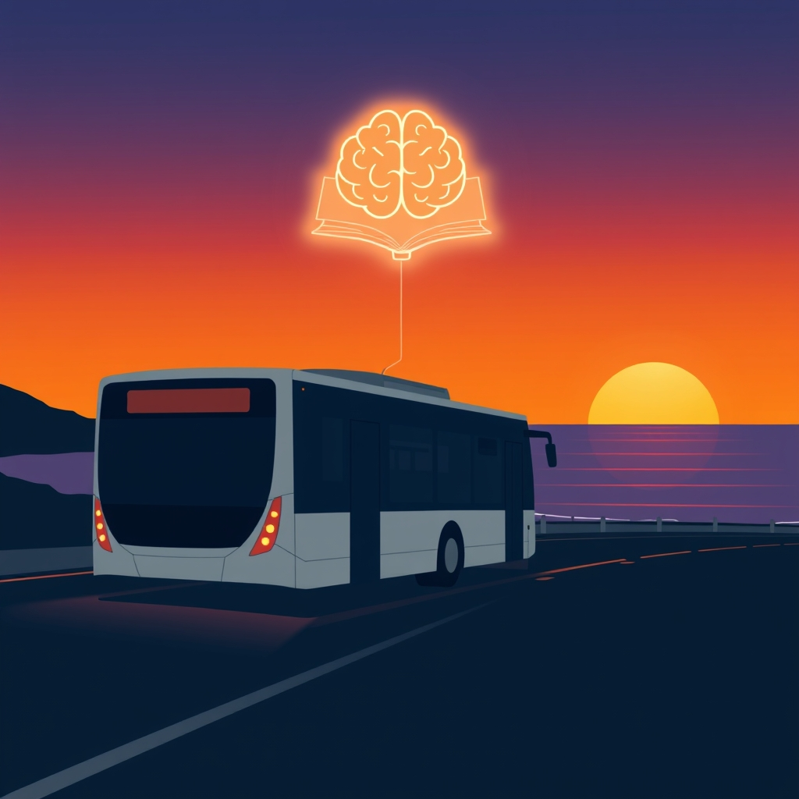

[Home](../index.md) > [Reflections](./index.md) | [⏮️](./2025-07-13.md) [⏭️](./2025-07-15.md)  
# 2025-07-14 | 🌄 Sunset | 🧠 Learning | 🚍 Bus  
  
  
## 📰 Local News  
- 🚍 [The Swift Gold Line will connect Everett, Marysville, and Arlington with fast, frequent bus service as soon as ⏳ 2031.](https://engage.communitytransit.org/swiftgold)  
  
## 📚 Books  
- [☀️📖🌿 The New Sunset Western Garden Book: The Ultimate Gardening Guide](../books/the-new-sunset-western-garden-book-the-ultimate-gardening-guide.md)  
- [🚀🧠🏆 Ultralearning: Master Hard Skills, Outsmart the Competition, and Accelerate Your Career](../books/ultralearning-master-hard-skills-outsmart-the-competition-and-accelerate-your-career.md)  
- [🧪👁️ The Scientific Image](../books/the-scientific-image.md)  
- [🤔🔬 The Logic of Scientific Discovery](../books/the-logic-of-scientific-discovery.md)  
  
## 📺 Videos  
- [🧠🪜💡🤔⬆️🎓 6 Levels of Thinking Every Student MUST Master](../videos/6-levels-of-thinking-every-student-must-master.md)  
- [❓🛠️👨‍🎓 The Black Box Effect: How To Learn ANY Skill Quickly](../videos/the-black-box-effect-how-to-learn-any-skill-quickly.md)  
- [🧠🚫📚 You’re Not Stupid: How to Learn Anything With Books](../videos/youre-not-stupid-how-to-learn-anything-with-books.md)  
- [🧠💪🤯🔄♾️ 15 Books So Hard They’ll Reshape Your Brain Forever](../videos/15-books-so-hard-theyll-reshape-your-brain-forever.md)  
- [🧠📈🥇 15 Books That Will Make You a Top 1% Thinker](../videos/15-books-that-will-make-you-a-top-1-percent-thinker.md)  
  
## 👥 People  
- [🧠👨‍🎓📈 Justin Sung](../people/justin-sung.md)