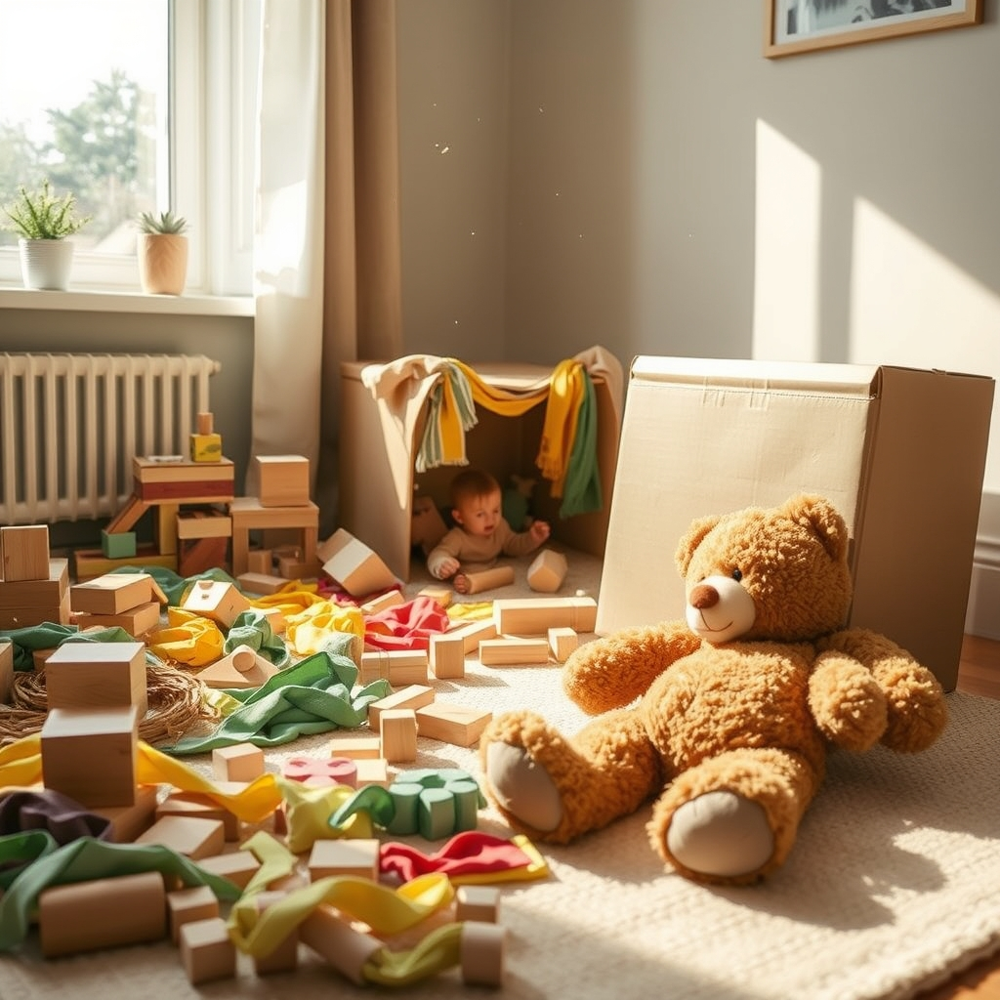

[Home](../index.md) > [Reflections](./index.md) | [⏮️](./2025-07-17.md) [⏭️](./2025-07-19.md)  
# 2025-07-18 | 🧸 Encourage Unstructured Play 📚  
  
  
## 📚 Books  
- ⏯️ Continuing [🧪👶📈 Scientific Secrets for Raising Kids Who Thrive](../books/scientific-secrets-for-raising-kids-who-thrive.md)