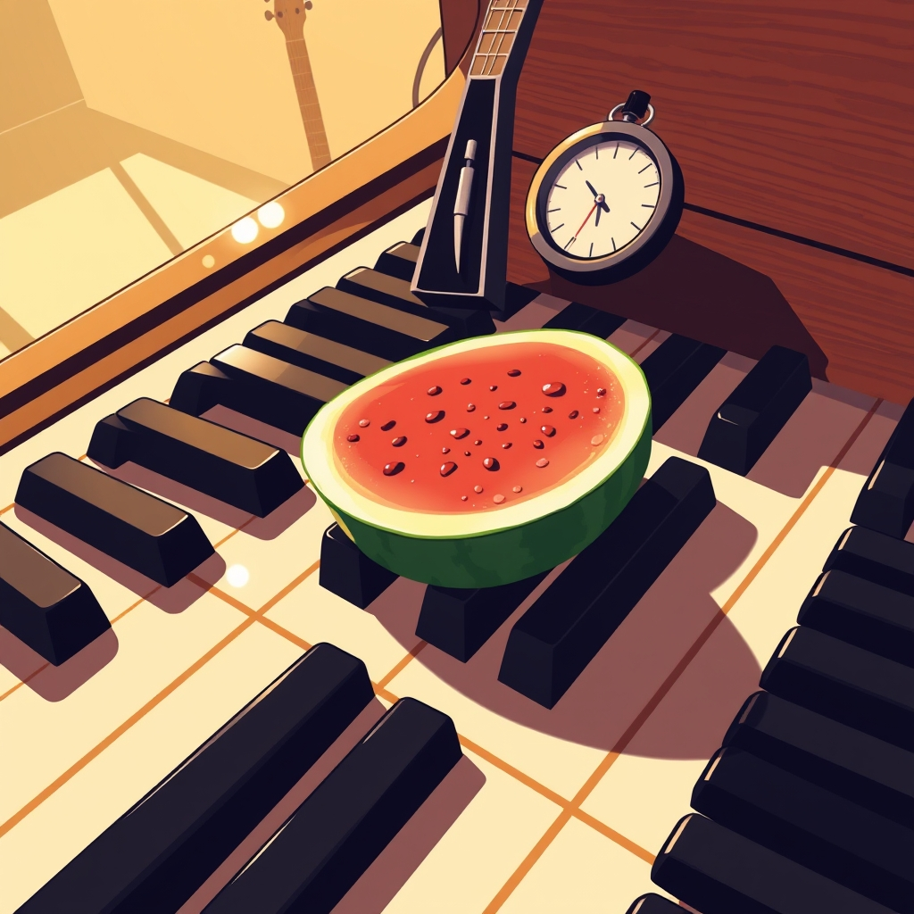

[Home](../index.md) > [Reflections](./index.md) | [⏮️](./2025-07-19.md) [⏭️](./2025-07-21.md)  
# 2025-07-20 | ✨ Motivation | 🎹 Music | 🍉 Melon 📺👶🏼  
  
## [📺 Videos](../videos/index.md)  
- [🚫⏳🔓 the secret hack that makes procrastination impossible](../videos/the-secret-hack-that-makes-procrastination-impossible.md)  
- [😴🧪💯🏆 The scientifically proven best night routine ever](../videos/the-scientifically-proven-best-night-routine-ever.md)  
- [✨🎯🔒✅ How to make your dreams basically inevitable](../videos/how-to-make-your-dreams-basically-inevitable.md)  
  
## 👶🏼 Introductions  
- 🎸 Guitar  
- 🎹 Piano  
- 🍉 Watermelon