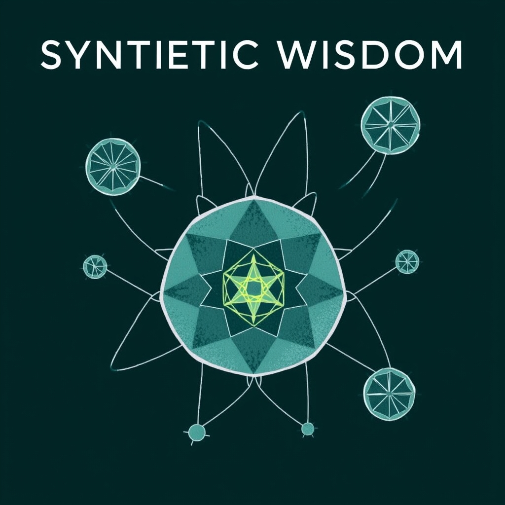

[Home](../index.md) > [Reflections](./index.md) | [⏮️](./2025-07-23.md) [⏭️](./2025-07-25.md)  
# 2025-07-24 | 🤖🧙‍♂️ Synthetic Wisdom 🤖💬  
  
When my blog turned [🥳 One 🕯️](./2025-04-19.md), I hypothesized that asking chatbots to combine insights from multiple books might [📈 Increase Value](./2025-04-20.md#🎯%20Goal%20📈%20Increase%20Value).  
  
Synthetic wisdom from a new [🤖💬 Bot Chat](../bot-chats/index.md) - [🎯🐜🌍 Purpose Driven Tiny Habits for Systemic Change](../bot-chats/purpose-driven-tiny-habits-for-systemic-change.md):  
> 🧩 Systemic change isn't a mandate, but a mosaic of tiny habits.  
>   
> 1. 🎯 **Define the system's true purpose.**  
> 2. 🌊 **Identify crucial flows.**  
> 3. ✨ **Craft high-impact, low-effort "golden behaviors"** for individuals.  
> 4. ⚓ **Anchor these tiny behaviors to existing routines** and 🎉 **celebrate instantly.**  
> 5. 🌱 **Nurture collective adoption;** 🔍 **observe systemic shifts.**  
>   
> 🦋 Small, sustained individual acts reshape the whole. 🌍  
  
❓ What do 🫵 you 🤔 think?