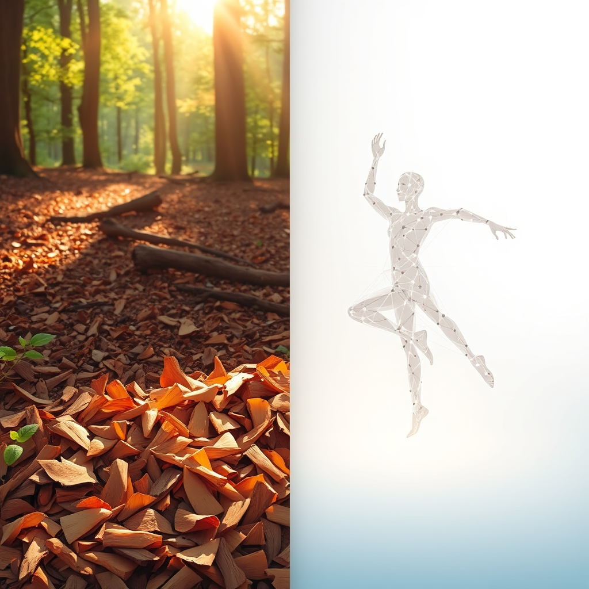

[Home](../index.md) > [Reflections](./index.md) | [⏮️](./2025-07-25.md) [⏭️](./2025-07-27.md)  
# 2025-07-26 | 🪵 Chip | 💃🏼 Dance 🤖💬📚📺  
  
  
## 🪵 [ChipDrop](https://getchipdrop.com)  
- 🌐 New order placed  
  
## [🤖💬 Bot Chats](../bot-chats/index.md)  
- [💃🕺🎶 Learn to Dance](../bot-chats/learn-to-dance.md)  
  
## [📚 Books](../books/index.md)  
- [💃➡️ Beginning Modern Dance](../books/beginning-modern-dance.md)  
  
## [📺 Videos](../videos/index.md)  
- [🩰🤸‍♀️🧑‍🏫📖 Ultimate Guide To Learning Dance For Beginners | STEEZY.CO](../videos/ultimate-guide-to-learning-dance-for-beginners-steezy-co.md)